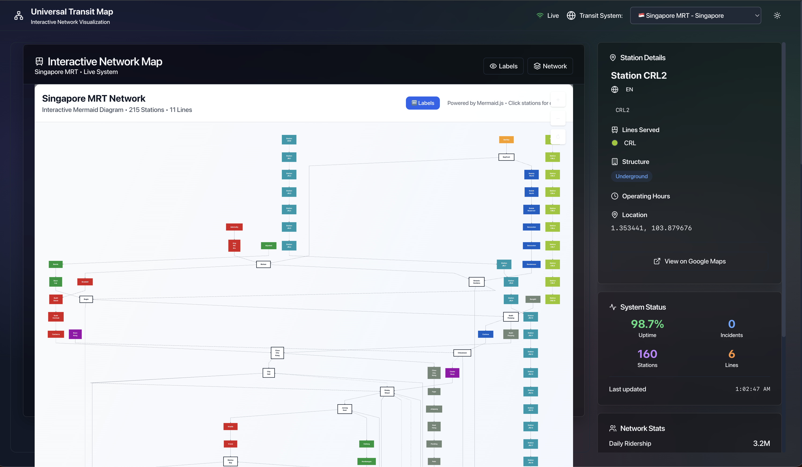

# Universal Transit Map

> **🙏 Built with immense gratitude to [@foldaway](https://github.com/foldaway) and the [MRTDown ecosystem](https://github.com/foldaway/mrtdown-data)**

Interactive transit maps for Singapore MRT, NYC Subway, Tokyo Metro, and more. Built with React, TypeScript, and modern web technologies.

   

## 🎯 Live Demo

**🌐 Try it now**: [https://johnxie.github.io/mrtdown/](https://johnxie.github.io/mrtdown/)

> The live demo automatically deploys from this repository and includes all three transit systems with real-time interactivity.

### Singapore MRT Network

*Interactive Singapore MRT map with real-time station information and multi-language support*

### New York Subway System  

*Comprehensive NYC Subway network with line filtering and station details*

### Tokyo Metro Network

*Tokyo Metro system visualization with interchange stations and route planning*

## ✨ Features

- **🌐 Multi-City Support**: Singapore MRT, NYC Subway, Tokyo Metro
- **🎨 Multiple Visualization Modes**: Mermaid diagrams, Enhanced maps, Official styling
- **📱 Responsive Design**: Works on desktop, tablet, and mobile
- **🌙 Dark Mode**: Beautiful dark theme with glass morphism effects
- **🗣️ Multi-Language**: English, Chinese, Malay, Tamil support for Singapore
- **⚡ Interactive**: Pan, zoom, click stations for details

## 🚀 Quick Start

```bash
# Clone the repository
git clone https://github.com/johnxie/mrtdown.git
cd mrtdown

# Install dependencies
cd mrt-map-app
npm install

# Start development server
npm run dev

# Open http://localhost:5173
```

## 🛠️ Tech Stack

- **React 18** with TypeScript
- **Tailwind CSS** for styling
- **Mermaid.js** for diagrams
- **Vite** for build tooling
- **shadcn/ui** components

## 🌍 Adding New Cities

1. Create data file in `mrt-map-app/src/data/`
2. Update `TransitSystemFactory` in `transitSystem.ts`
3. Add to `CitySelector` component

## 📄 License

MIT License - see [LICENSE](LICENSE) file for details.

### Data Sources
- Singapore MRT: [MRTDown](https://github.com/foldaway/mrtdown-data) by @foldaway
- NYC Subway: MTA Open Data
- Tokyo Metro: Official Tokyo Metro data

## 🤝 Contributing

Contributions welcome! Please read [CONTRIBUTING.md](CONTRIBUTING.md) for guidelines.

---

**Built with ❤️ for the global transit community**