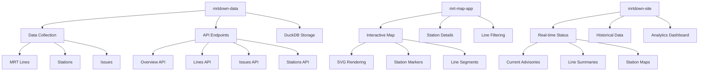

# mrtdown Documentation

This documentation provides comprehensive guidance for understanding and working with the **mrtdown** Singapore MRT monitoring system.

## What is mrtdown?

mrtdown is a comprehensive tracking system for Singapore's MRT (Mass Rapid Transit) network that consists of three interconnected components:

- **mrtdown-data**: Data collection engine and API server
- **mrt-map-app**: Interactive MRT network map visualization
- **mrtdown-site**: Public website for MRT status monitoring

## Documentation Structure

### 📚 Tutorial Chapters

1. **[Understanding MRT Data](./mrtdown/01_mrt_data_model.md)** - Learn about MRT lines, stations, and issue tracking
2. **[Data Collection Engine](./mrtdown/02_data_collection.md)** - How mrtdown gathers official MRT data
3. **[API Architecture](./mrtdown/03_api_design.md)** - Building the data serving layer
4. **[Interactive Map System](./mrtdown/04_map_visualization.md)** - Creating the SVG-based MRT network map
5. **[Real-Time Status Dashboard](./mrtdown/05_realtime_status.md)** - Monitoring current MRT system health
6. **[Historical Analytics](./mrtdown/06_historical_analytics.md)** - Analyzing MRT performance over time
7. **[Multi-language Support](./mrtdown/07_multilanguage.md)** - Supporting 4 languages across the system
8. **[Deployment & Integration](./mrtdown/08_deployment.md)** - Getting your MRT monitor running

## Quick Start

### For Developers

If you're new to mrtdown and want to understand how it works:

1. Start with **[Chapter 1](./mrtdown/01_mrt_data_model.md)** to understand MRT data fundamentals
2. Follow the chapters in order to build your understanding progressively
3. Each chapter includes code examples and practical implementations

### For Contributors

If you want to contribute to the mrtdown project:

1. Read the **[API Architecture](./mrtdown/03_api_design.md)** chapter to understand the system design
2. Study the **[Data Collection](./mrtdown/02_data_collection.md)** chapter for data processing
3. Review **[Deployment](./mrtdown/08_deployment.md)** for production setup

## System Overview

## Key Features

### 🔄 Real-Time Monitoring
- Live MRT service status updates
- Real-time disruption alerts
- WebSocket-based live updates

### 🗺️ Interactive Visualization
- Schematic MRT network map
- Interactive station details
- Route planning and highlighting

### 📊 Advanced Analytics
- Historical uptime analysis
- Pattern recognition and forecasting
- Performance trend analysis

### 🌍 Multi-Language Support
- English, Chinese, Malay, Tamil
- Cultural context adaptation
- Automatic language detection

### 🛡️ Production Ready
- High availability deployment
- Comprehensive monitoring
- Security and compliance

## Technology Stack

- **Backend**: Node.js, TypeScript, Hono
- **Database**: DuckDB (analytical), PostgreSQL (production)
- **Frontend**: React, Tailwind CSS
- **Infrastructure**: Google Cloud Platform
- **Monitoring**: Custom APM, alerting systems

## API Reference

The mrtdown system exposes several key APIs:

- `GET /overview` - System-wide status
- `GET /lines/{lineId}` - Line-specific information
- `GET /stations/{stationId}` - Station details
- `GET /issues` - Current disruptions
- `GET /analytics/*` - Historical data and trends

## Contributing

We welcome contributions to improve the mrtdown system! Please:

1. Read our [Contributing Guide](./CONTRIBUTING.md)
2. Check the [API Documentation](./mrtdown/03_api_design.md)
3. Review the [Deployment Guide](./mrtdown/08_deployment.md)
4. Submit issues and pull requests

## Support

- **Documentation**: [docs.mrtdown.sg](https://docs.mrtdown.sg)
- **API Reference**: [api.mrtdown.sg/docs](https://api.mrtdown.sg/docs)
- **Status Page**: [status.mrtdown.sg](https://status.mrtdown.sg)
- **GitHub Issues**: [github.com/mrtdown/mrtdown/issues](https://github.com/mrtdown/mrtdown/issues)

## License

This documentation is part of the mrtdown project, licensed under the MIT License.

---

*Generated by [AI Codebase Knowledge Builder](https://github.com/The-Pocket/Tutorial-Codebase-Knowledge)*

Happy coding with mrtdown! 🚇✨
