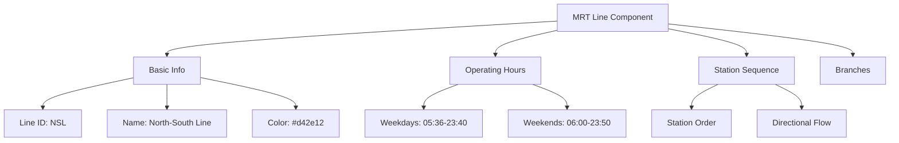
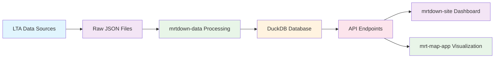

# Chapter 1: Understanding MRT Data

Welcome to the world of MRT (Mass Rapid Transit) data! Before we dive into building our monitoring system, let's understand what makes MRT data special and how Singapore's public transportation network is structured.

Imagine you're trying to monitor the health of a busy highway system with multiple lanes, exits, and traffic patterns. That's essentially what we're doing with Singapore's MRT network - tracking the flow of trains, stations, and potential disruptions across a complex transportation ecosystem.

## What Makes MRT Data Unique?

Singapore's MRT system isn't just a collection of trains and tracks - it's a sophisticated network that serves millions of commuters daily. Here's what makes MRT data different from typical transportation data:

### Geographic Precision
```typescript
// Every MRT station has exact coordinates
interface Station {
  id: "JUR",  // Unique identifier
  name: "Jurong East",
  coordinates: {
    lat: 1.3352,    // Precise latitude
    lng: 103.7438   // Precise longitude
  }
}
```

### Multi-language Support
```typescript
// Station names in 4 official languages
interface Station {
  name: "Dhoby Ghaut",
  name_translations: {
    'zh-Hans': '多美歌',  // Chinese (Simplified)
    'ms': 'Dhoby Ghaut',  // Malay
    'ta': 'டோபி காட்'    // Tamil
  }
}
```

### Complex Line Structures
```typescript
// MRT lines have branches and multiple segments
interface MRTLine {
  id: "EWL",  // East-West Line
  name: "East-West Line",
  stations: ["PSR", "TAM", "SIM", /* ... */],
  branches: {
    main: {
      stations: ["PSR", "TAM", /* main line */]
    },
    changi_airport: {
      stations: ["TNM", "EXP", "CG1", "CG2"]  // Airport branch
    }
  }
}
```

## Core Data Abstractions

Let's explore the three fundamental building blocks of MRT data:

### 1. Components (MRT Lines)
Components represent the physical MRT lines that crisscross Singapore:



**Key Features:**
- **Line Identity**: Each line has a unique code (NSL, EWL, CCL, etc.)
- **Official Colors**: LTA-approved color schemes for visual consistency
- **Operating Hours**: Different schedules for weekdays vs weekends
- **Branching Logic**: Some lines split into multiple branches (like EWL's airport extension)

### 2. Stations (Network Nodes)
Stations are the connection points where passengers board, alight, and transfer:

```typescript
interface Station {
  id: "CTH",  // City Hall station
  name: "City Hall",
  codes: ["NS25", "EW13"],  // Station codes on different lines
  lines: ["NSL", "EWL"],    // Which lines serve this station
  isInterchange: true,      // Can passengers transfer here?
  structureType: "underground",  // elevated/underground/at_grade
  coordinates: {
    lat: 1.293239,
    lng: 103.852219
  }
}
```

**Interchange Stations:**
Some stations are transportation hubs where multiple lines meet. These are critical for network connectivity and often have complex layouts.

### 3. Issues (Disruptions & Events)
Issues track everything that affects MRT service quality:

```typescript
interface Issue {
  id: "2024-01-15-signal-failure",
  title: "Signal System Fault at Newton Station",
  type: "disruption",  // disruption | maintenance | infra
  severity: "high",
  affectedLines: ["NSL", "DTL"],
  affectedStations: ["NEW", "ORC", "SOM"],
  timeInterval: {
    start: "2024-01-15T14:30:00Z",
    end: "2024-01-15T16:45:00Z"
  },
  status: "resolved"
}
```

**Issue Types:**
- **Disruption**: Unexpected service interruptions (signals, power, etc.)
- **Maintenance**: Scheduled work that affects service
- **Infrastructure**: Long-term construction or upgrades

## How MRT Data Flows

Understanding the data flow is crucial for building an effective monitoring system:



## Real-World Example: Dhoby Ghaut Interchange

Let's look at a complex interchange to understand MRT data relationships:

```typescript
// Dhoby Ghaut is where 3 lines meet: NSL, NEL, CCL
const dhobyGhaut = {
  id: "DBG",
  name: "Dhoby Ghaut",
  codes: ["NS24", "NE6", "CC1"],  // One code per line
  lines: ["NSL", "NEL", "CCL"],    // All three lines
  isInterchange: true,
  structureType: "underground",
  coordinates: { lat: 1.300419, lng: 103.849283 },

  // This station appears in multiple line definitions
  lineContexts: {
    NSL: { code: "NS24", position: 24 },  // 24th station on North-South Line
    NEL: { code: "NE6", position: 6 },    // 6th station on North East Line
    CCL: { code: "CC1", position: 1 }     // 1st station on Circle Line
  }
}
```

**Why This Matters:**
- **Transfer Planning**: Apps need to know transfer times between lines
- **Capacity Management**: Interchange stations handle more passengers
- **Navigation**: Users need clear directions through complex layouts

## Data Quality Considerations

MRT data must be exceptionally reliable because it affects millions of commuters:

### Temporal Accuracy
```typescript
// Issues must have precise timestamps
interface Issue {
  timeInterval: {
    start: "2024-01-15T14:30:00+08:00",  // Singapore timezone
    end: "2024-01-15T16:45:00+08:00"     // Exact end time
  },
  lastUpdated: "2024-01-15T16:50:00+08:00"  // Real-time updates
}
```

### Geographic Precision
- Station coordinates must be accurate within meters
- Line paths need to reflect actual track layouts
- Interchange connections must match physical layouts

### Multi-language Consistency
- All station names must be correctly translated
- Technical terms need appropriate equivalents
- Cultural context matters for user experience

## How it Works Under the Hood

The mrtdown system processes this data through several layers:

1. **Data Ingestion**: Pulls official data from LTA sources
2. **Normalization**: Converts raw data into consistent formats
3. **Validation**: Ensures data quality and referential integrity
4. **Storage**: Efficiently stores relationships in DuckDB
5. **API Serving**: Makes data available through REST endpoints
6. **Visualization**: Renders data as interactive maps and charts

## Key Takeaways

- **MRT data is geospatial**: Everything has coordinates and spatial relationships
- **Interchanges are complex**: Stations where lines meet require special handling
- **Time matters**: Service schedules and issue timing are critical
- **Multi-language support**: Content must work across 4 official languages
- **Real-time nature**: Data changes frequently and affects live decisions

---

## What's Next?

Now that you understand MRT data fundamentals, let's explore how mrtdown collects this data from official sources. In [Chapter 2](./02_data_collection.md), we'll dive into the data collection engine that feeds our MRT monitoring system!

> 💡 **Pro tip**: Think of MRT stations like cities in a transportation network. Just as cities have populations, coordinates, and connections to other cities, MRT stations have passenger volumes, precise locations, and connections to other lines.
