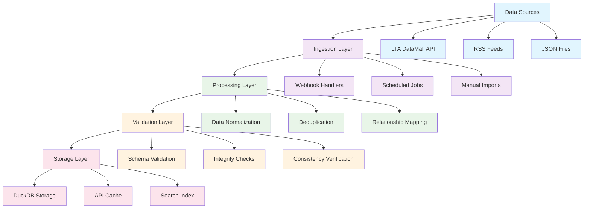
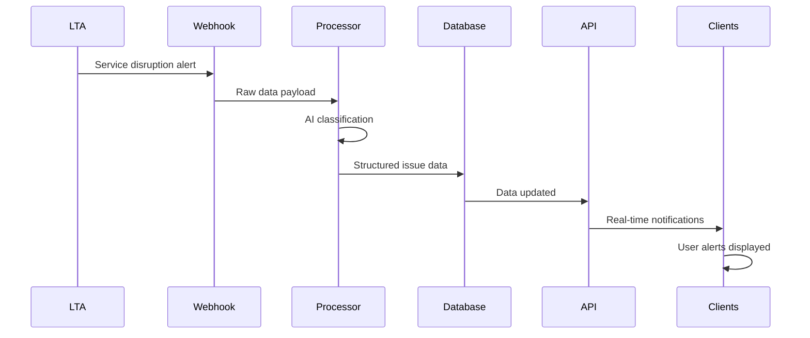

# Chapter 2: Data Collection Engine

Welcome back! Now that you understand MRT data structure, let's explore how mrtdown gathers this information from official sources. Think of this as the "data mining operation" that feeds our MRT monitoring system.

Imagine you're building a weather monitoring system. You wouldn't just guess the weather - you'd collect data from satellites, weather stations, and meteorological services. Similarly, mrtdown collects MRT data from official government sources, RSS feeds, and structured APIs.

## The Data Sources Landscape

Singapore's MRT data comes from several authoritative sources:

### 1. Land Transport Authority (LTA) DataMall
The primary source of official MRT information:

```typescript
// LTA provides structured APIs for:
// - Station information (names, codes, coordinates)
// - Line definitions (routes, schedules)
// - Real-time service alerts
// - Historical performance data

interface LTADataSource {
  baseUrl: "https://datamall.lta.gov.sg",
  endpoints: {
    stationInfo: "/StationInfo",
    lineRoutes: "/LineRoutes",
    serviceAlerts: "/ServiceAlerts"
  },
  authentication: {
    apiKey: process.env.LTA_API_KEY,
    rateLimit: "300 requests/minute"
  }
}
```

### 2. RSS Feed Monitoring
Real-time disruption updates via RSS feeds:

```xml
<!-- Example RSS feed structure -->
<rss version="2.0">
  <channel>
    <title>LTA MRT Service Updates</title>
    <item>
      <title>Signal fault at Newton Station</title>
      <description>North-South Line experiencing delays</description>
      <pubDate>Mon, 15 Jan 2024 14:30:00 +0800</pubDate>
      <guid>https://www.lta.gov.sg/incident-12345</guid>
    </item>
  </channel>
</rss>
```

### 3. Structured JSON Files
Pre-processed MRT network definitions:

```json
{
  "component": {
    "NSL": {
      "id": "NSL",
      "title": "North-South Line",
      "color": "#d42e12",
      "operatingHours": {
        "weekdays": { "start": "05:36", "end": "23:40" }
      },
      "stationCodes": ["NS1", "NS2", "NS3", /* ... */]
    }
  }
}
```

## Data Collection Architecture

The mrtdown data collection system follows a layered approach:



## Core Data Ingestion Components

Let's look at the key components that make data collection work:

### 1. Webhook Handler System
Handles real-time updates from external sources:

```typescript
// src/scripts/ingestViaWebhook.ts
class WebhookHandler {
  async handleIncomingData(payload: WebhookPayload) {
    // 1. Validate incoming data structure
    const validatedData = this.validatePayload(payload);

    // 2. Transform to internal format
    const normalizedData = this.normalizeData(validatedData);

    // 3. Check for duplicates/updates
    const existingRecord = await this.findExistingRecord(normalizedData);

    // 4. Store or update in database
    if (existingRecord) {
      await this.updateRecord(existingRecord.id, normalizedData);
    } else {
      await this.createNewRecord(normalizedData);
    }

    // 5. Trigger downstream processes
    await this.notifySubscribers(normalizedData);
  }
}
```

### 2. RSS Feed Processor
Monitors official RSS feeds for service updates:

```typescript
// src/scripts/checkRssFeeds.ts
class RSSProcessor {
  private feeds = [
    'https://www.lta.gov.sg/rss/mrt-updates.xml',
    'https://www.smrt.com.sg/rss/service-advisories.xml'
  ];

  async processFeeds() {
    for (const feedUrl of this.feeds) {
      const feedData = await this.fetchRSSFeed(feedUrl);
      const newItems = await this.extractNewItems(feedData);

      for (const item of newItems) {
        await this.processRSSItem(item);
      }
    }
  }

  private async processRSSItem(item: RSSItem) {
    // Extract issue information from RSS
    const issueData = {
      title: item.title,
      description: item.description,
      source: 'rss',
      timestamp: new Date(item.pubDate),
      url: item.link
    };

    // Use AI to classify and structure the issue
    const structuredIssue = await this.classifyIssueWithAI(issueData);

    // Store in database
    await this.storeIssue(structuredIssue);
  }
}
```

### 3. Data Normalization Engine
Converts various data formats into consistent internal structures:

```typescript
// src/util/ingestContent/normalizeData.ts
class DataNormalizer {
  normalizeStation(stationData: any): NormalizedStation {
    return {
      id: this.generateStationId(stationData),
      name: this.cleanStationName(stationData.name),
      codes: this.extractStationCodes(stationData),
      lines: this.determineServingLines(stationData),
      coordinates: this.parseCoordinates(stationData),
      translations: this.processTranslations(stationData),
      isInterchange: this.detectInterchangeStatus(stationData)
    };
  }

  normalizeIssue(issueData: any): NormalizedIssue {
    return {
      id: this.generateIssueId(issueData),
      title: this.cleanTitle(issueData.title),
      type: this.classifyIssueType(issueData),
      severity: this.assessSeverity(issueData),
      affectedEntities: this.extractAffectedEntities(issueData),
      timeInterval: this.parseTimeInterval(issueData),
      status: this.determineStatus(issueData)
    };
  }
}
```

## AI-Powered Data Processing

One of mrtdown's unique features is AI-assisted data processing:

```typescript
// Uses OpenAI to intelligently classify issues
class AIClassifier {
  async classifyIssue(description: string) {
    const prompt = `
      Analyze this MRT service description and classify it:

      "${description}"

      Return JSON with:
      - type: "disruption" | "maintenance" | "infra"
      - severity: "low" | "medium" | "high" | "critical"
      - affectedLines: array of line codes
      - affectedStations: array of station codes
      - estimatedDuration: time in minutes
    `;

    const response = await this.openai.chat.completions.create({
      model: "gpt-4",
      messages: [{ role: "user", content: prompt }]
    });

    return JSON.parse(response.choices[0].message.content);
  }
}
```

## Database Storage Strategy

mrtdown uses DuckDB for efficient data storage and querying:

```sql
-- Core tables in the mrtdown database
CREATE TABLE components (
  id TEXT PRIMARY KEY,
  title TEXT NOT NULL,
  type TEXT NOT NULL,
  color TEXT NOT NULL,
  operating_hours JSON,
  created_at TIMESTAMP DEFAULT CURRENT_TIMESTAMP
);

CREATE TABLE stations (
  id TEXT PRIMARY KEY,
  name TEXT NOT NULL,
  codes JSON,  -- Array of station codes
  lines JSON,  -- Array of serving lines
  coordinates JSON,
  translations JSON,
  is_interchange BOOLEAN,
  structure_type TEXT
);

CREATE TABLE issues (
  id TEXT PRIMARY KEY,
  title TEXT NOT NULL,
  description TEXT,
  type TEXT NOT NULL,
  severity TEXT NOT NULL,
  affected_lines JSON,
  affected_stations JSON,
  time_interval JSON,
  status TEXT NOT NULL,
  source TEXT,
  created_at TIMESTAMP DEFAULT CURRENT_TIMESTAMP,
  updated_at TIMESTAMP DEFAULT CURRENT_TIMESTAMP
);
```

## Data Validation Pipeline

Ensures data quality before storage:

```typescript
// src/schema/validation.ts
class DataValidator {
  validateComponent(component: any): ValidationResult {
    const schema = z.object({
      id: z.string().regex(/^[A-Z]{2,4}$/),
      title: z.string().min(1),
      type: z.enum(['mrt.high', 'mrt.medium', 'lrt']),
      color: z.string().regex(/^#[0-9a-f]{6}$/i),
      operatingHours: z.object({
        weekdays: z.object({
          start: z.string().regex(/^\d{2}:\d{2}$/),
          end: z.string().regex(/^\d{2}:\d{2}$/)
        })
      })
    });

    return schema.safeParse(component);
  }

  validateStationRelationships(station: Station, components: Component[]) {
    // Ensure station codes match component definitions
    const stationLines = new Set(station.lines);
    const componentLines = new Set(components.map(c => c.id));

    const invalidLines = Array.from(stationLines)
      .filter(line => !componentLines.has(line));

    if (invalidLines.length > 0) {
      throw new ValidationError(`Station references invalid lines: ${invalidLines}`);
    }
  }
}
```

## Real-Time Data Flow

How new MRT data moves through the system:



## Configuration Management

The system is highly configurable for different environments:

```typescript
// src/api/constants.ts
export const CONFIG = {
  dataSources: {
    ltaApiKey: process.env.LTA_API_KEY,
    rssFeeds: [
      'https://www.lta.gov.sg/rss/mrt-updates.xml',
      'https://www.smrt.com.sg/rss/service-advisories.xml'
    ],
    updateIntervals: {
      rssPolling: 5 * 60 * 1000,      // 5 minutes
      apiRefresh: 15 * 60 * 1000,     // 15 minutes
      cacheExpiry: 60 * 60 * 1000     // 1 hour
    }
  },

  processing: {
    aiEnabled: process.env.OPENAI_API_KEY !== undefined,
    batchSize: 100,
    retryAttempts: 3,
    timeoutMs: 30000
  },

  database: {
    path: process.env.DUCKDB_DATABASE_PATH || './mrtdown.duckdb',
    maxConnections: 10,
    queryTimeout: 30000
  }
};
```

## Monitoring & Health Checks

Built-in monitoring ensures the data collection system stays healthy:

```typescript
// Health check endpoint
app.get('/health', async (c) => {
  const health = {
    database: await checkDatabaseHealth(),
    rssFeeds: await checkRSSHealth(),
    apiConnections: await checkAPIHealth(),
    lastDataUpdate: await getLastUpdateTime(),
    systemLoad: process.cpuUsage()
  };

  const isHealthy = Object.values(health).every(status =>
    typeof status === 'object' ? status.ok : true
  );

  return c.json(health, isHealthy ? 200 : 503);
});
```

## How it Works Under the Hood

The data collection engine operates continuously:

1. **Scheduled Jobs**: Run every 5 minutes to check RSS feeds
2. **Webhook Listeners**: Receive real-time updates from LTA
3. **API Polling**: Fetch structured data from LTA DataMall
4. **AI Processing**: Use GPT to classify and structure raw updates
5. **Validation Pipeline**: Ensure data quality and consistency
6. **Database Updates**: Store processed data in DuckDB
7. **Cache Invalidation**: Update API caches for fast serving
8. **Notification System**: Alert downstream systems of changes

## Key Takeaways

- **Multiple Data Sources**: Combines RSS feeds, APIs, and structured files
- **AI-Assisted Processing**: Uses machine learning for data classification
- **Real-Time Updates**: Processes data as it becomes available
- **Quality Assurance**: Validates all data before storage
- **Scalable Architecture**: Handles varying data volumes and frequencies

---

## What's Next?

With our data collection engine running smoothly, let's explore how this data gets served to users through APIs. In [Chapter 3](./03_api_design.md), we'll build the API layer that makes MRT data available to maps, dashboards, and mobile apps!

> 💡 **Pro tip**: Think of the data collection engine as a city's water treatment plant. Raw water comes from various sources (rivers, reservoirs), gets processed and purified, then gets distributed through pipes (APIs) to homes and businesses (applications).
