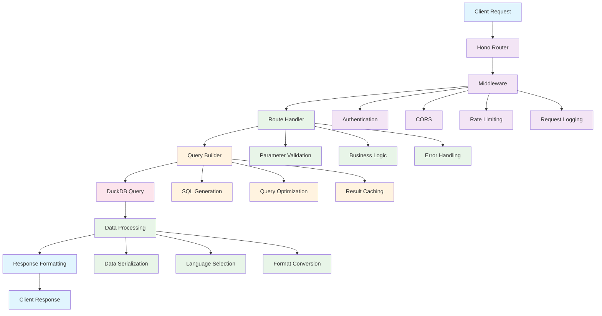

# Chapter 3: API Architecture

Excellent! You now understand how mrtdown collects MRT data. Let's explore how this data gets served to applications through a well-designed API. Think of the API as the "water pipes" that deliver clean, structured MRT data to maps, dashboards, and mobile apps.

Imagine you're building a restaurant. You have the best ingredients (MRT data) and skilled chefs (data processing), but you need an efficient kitchen system to serve meals to customers quickly and reliably. That's what a good API does - it takes complex data operations and makes them simple for consuming applications.

## API Design Philosophy

mrtdown's API follows RESTful principles with these key characteristics:

### 1. Resource-Centric Design
Everything is a resource with clear, predictable URLs:

```typescript
// Clean, intuitive API endpoints
GET /overview          // System-wide status
GET /lines/NSL         // North-South Line details
GET /stations/JUR      // Jurong East station info
GET /issues            // Recent disruptions
GET /analytics/monthly // Historical analytics
```

### 2. Consistent Response Format
All endpoints return data in the same structure:

```typescript
interface APIResponse<T> {
  success: boolean;
  data: T;
  meta: {
    timestamp: string;
    requestId: string;
    version: string;
  };
  links?: {
    self: string;
    next?: string;
    prev?: string;
  };
}
```

### 3. Multi-language Support
Content adapts to user language preferences:

```typescript
// Accept-Language header determines response language
GET /lines/NSL
Accept-Language: zh-Hans

Response:
{
  "success": true,
  "data": {
    "id": "NSL",
    "name": "南北地铁线",  // Chinese name
    "nameEnglish": "North-South Line"
  }
}
```

## Core API Endpoints

Let's explore the main API endpoints that power mrtdown applications:

### 1. System Overview (`/overview`)
Provides a high-level view of MRT system health:

```typescript
// GET /overview
{
  "success": true,
  "data": {
    "systemStatus": "normal",
    "activeIssues": 2,
    "lines": [
      {
        "id": "NSL",
        "name": "North-South Line",
        "status": "normal",
        "uptime": 0.987,  // 98.7% uptime this month
        "currentIssues": []
      },
      {
        "id": "EWL",
        "name": "East-West Line",
        "status": "disrupted",
        "uptime": 0.956,
        "currentIssues": [
          {
            "id": "signal-fault-2024-01-15",
            "title": "Signal System Fault",
            "severity": "high"
          }
        ]
      }
    ],
    "lastUpdated": "2024-01-15T14:30:00Z"
  }
}
```

### 2. Line Details (`/lines/{lineId}`)
Comprehensive information about specific MRT lines:

```typescript
// GET /lines/NSL
{
  "success": true,
  "data": {
    "id": "NSL",
    "name": "North-South Line",
    "color": "#d42e12",
    "type": "mrt.high",
    "operatingHours": {
      "weekdays": { "start": "05:36", "end": "23:40" },
      "weekends": { "start": "06:00", "end": "23:50" }
    },
    "stations": [
      {
        "id": "JUR",
        "name": "Jurong East",
        "code": "NS1",
        "position": 1,
        "coordinates": { "lat": 1.3352, "lng": 103.7438 }
      }
      // ... all 27 stations
    ],
    "branches": {
      "main": {
        "name": "Main Branch",
        "stations": ["NS1", "NS2", /* ... */, "NS28"]
      }
    },
    "statistics": {
      "totalStations": 27,
      "totalLength": 45.0,  // kilometers
      "averageSpeed": 35,   // km/h
      "passengerCapacity": 800  // per train
    }
  }
}
```

### 3. Station Information (`/stations/{stationId}`)
Detailed information about individual stations:

```typescript
// GET /stations/DBG
{
  "success": true,
  "data": {
    "id": "DBG",
    "name": "Dhoby Ghaut",
    "name_translations": {
      "zh-Hans": "多美歌",
      "ms": "Dhoby Ghaut",
      "ta": "டோபி காட்"
    },
    "codes": ["NS24", "NE6", "CC1"],
    "lines": ["NSL", "NEL", "CCL"],
    "coordinates": { "lat": 1.300419, "lng": 103.849283 },
    "isInterchange": true,
    "structureType": "underground",
    "connections": [
      {
        "line": "NSL",
        "direction": "north",
        "nextStation": "SOM",
        "travelTime": 2
      },
      {
        "line": "NEL",
        "direction": "northeast",
        "nextStation": "LTI",
        "travelTime": 3
      }
    ],
    "facilities": ["wheelchair-access", "shop", "food-court"]
  }
}
```

### 4. Issues & Disruptions (`/issues`)
Current and historical service disruptions:

```typescript
// GET /issues?status=active&limit=10
{
  "success": true,
  "data": [
    {
      "id": "signal-fault-2024-01-15",
      "title": "Signal System Fault at Newton Station",
      "description": "Technical fault affecting train services",
      "type": "disruption",
      "severity": "high",
      "affectedLines": ["NSL", "DTL"],
      "affectedStations": ["NEW", "ORC", "SOM", "DBG"],
      "timeInterval": {
        "start": "2024-01-15T14:30:00Z",
        "end": null  // Ongoing
      },
      "status": "active",
      "estimatedResolution": "2024-01-15T16:00:00Z",
      "updates": [
        {
          "timestamp": "2024-01-15T14:30:00Z",
          "message": "Signal fault detected. Trains running with delays."
        },
        {
          "timestamp": "2024-01-15T15:15:00Z",
          "message": "Technicians en route. Expected resolution in 30 minutes."
        }
      ]
    }
  ],
  "meta": {
    "total": 1,
    "page": 1,
    "limit": 10
  }
}
```

### 5. Analytics & Statistics (`/analytics`)
Historical performance data and trends:

```typescript
// GET /analytics/uptime?period=month&lines=NSL,EWL
{
  "success": true,
  "data": {
    "period": "2024-01",
    "lines": {
      "NSL": {
        "uptime": 0.987,
        "totalDowntime": 2340,  // minutes
        "majorIncidents": 2,
        "averageDelay": 3.2     // minutes per incident
      },
      "EWL": {
        "uptime": 0.956,
        "totalDowntime": 6840,
        "majorIncidents": 5,
        "averageDelay": 4.1
      }
    },
    "system": {
      "overallUptime": 0.972,
      "totalIncidents": 7,
      "mostAffectedLine": "EWL",
      "bestPerformingLine": "CCL"
    }
  }
}
```

## API Architecture Deep Dive

Let's explore how the API is structured:

### Route Organization
```typescript
// src/api/routes/ - Organized by resource type
/api/routes/
├── overview.ts     // System status
├── lines.ts        // Line management
├── stations.ts     // Station information
├── issues.ts       // Disruption tracking
├── analytics.ts    // Performance analytics
└── health.ts       // System health
```

### Hono Framework Integration
mrtdown uses Hono for its API framework:

```typescript
// src/api/index.ts
import { Hono } from 'hono';
import { cors } from 'hono/cors';
import { logger } from 'hono/logger';

const app = new Hono();

// Middleware
app.use('*', cors());
app.use('*', logger());

// Route handlers
app.route('/overview', overviewRoutes);
app.route('/lines', lineRoutes);
app.route('/stations', stationRoutes);
app.route('/issues', issueRoutes);

// Health check
app.get('/healthz', (c) => c.text('OK'));

export default app;
```

### Database Query Layer
Efficient database queries power the API:

```typescript
// src/api/queries/entities.ts
export class EntityQueries {
  // System overview with uptime calculations
  async getSystemOverview() {
    const query = `
      WITH line_stats AS (
        SELECT
          c.id,
          c.title,
          COUNT(DISTINCT s.id) as station_count,
          AVG(CASE WHEN i.type = 'disruption' THEN 1 ELSE 0 END) as disruption_rate
        FROM components c
        LEFT JOIN stations s ON c.id = ANY(s.lines)
        LEFT JOIN issues i ON c.id = ANY(i.affected_lines)
          AND i.time_interval @> NOW()::timestamp
        GROUP BY c.id, c.title
      )
      SELECT
        c.id,
        c.title,
        c.color,
        ls.station_count,
        ls.disruption_rate,
        CASE
          WHEN ls.disruption_rate > 0.1 THEN 'disrupted'
          WHEN ls.disruption_rate > 0 THEN 'minor_issues'
          ELSE 'normal'
        END as status
      FROM components c
      JOIN line_stats ls ON c.id = ls.id
      ORDER BY c.id
    `;

    return this.db.query(query);
  }
}
```

## Data Serialization Strategy

Efficient data formatting for different clients:

### 1. Mobile-Optimized Responses
```typescript
// Compact format for mobile apps
app.get('/overview/mobile', (c) => {
  const overview = await getSystemOverview();

  return c.json({
    status: overview.systemStatus,
    activeIssues: overview.activeIssues.length,
    lines: overview.lines.map(line => ({
      id: line.id,
      status: line.status,
      // Minimal data for mobile
    }))
  });
});
```

### 2. Web Dashboard Format
```typescript
// Rich format for web applications
app.get('/overview/dashboard', (c) => {
  const overview = await getSystemOverview();

  return c.json({
    ...overview,
    charts: {
      uptimeData: await getUptimeChartData(),
      issueTrends: await getIssueTrendData(),
      stationLoad: await getStationLoadData()
    },
    realTime: {
      activeTrains: await getActiveTrainCount(),
      nextMaintenance: await getUpcomingMaintenance()
    }
  });
});
```

## Caching Strategy

Performance optimization through intelligent caching:

```typescript
// Redis-based caching
class APICache {
  async getCachedResponse(key: string, ttl: number = 300) {
    const cached = await this.redis.get(key);
    if (cached) return JSON.parse(cached);

    const fresh = await this.fetchFreshData(key);
    await this.redis.setex(key, ttl, JSON.stringify(fresh));
    return fresh;
  }

  // Cache invalidation on data updates
  async invalidateCache(pattern: string) {
    const keys = await this.redis.keys(pattern);
    if (keys.length > 0) {
      await this.redis.del(keys);
    }
  }
}

// Usage in API routes
app.get('/overview', async (c) => {
  const cacheKey = 'overview:main';
  const data = await cache.getCachedResponse(cacheKey, 60); // 1 minute TTL
  return c.json(data);
});
```

## Authentication & Security

Bearer token authentication for API access:

```typescript
// src/api/middleware/auth.ts
export const authMiddleware = async (c, next) => {
  const authHeader = c.req.header('Authorization');

  if (!authHeader || !authHeader.startsWith('Bearer ')) {
    return c.json({ error: 'Missing or invalid token' }, 401);
  }

  const token = authHeader.slice(7);
  const validTokens = process.env.API_TOKENS?.split(',') || [];

  if (!validTokens.includes(token)) {
    return c.json({ error: 'Invalid token' }, 401);
  }

  await next();
};

// Apply to protected routes
app.use('/api/*', authMiddleware);
```

## Error Handling & Monitoring

Robust error handling and monitoring:

```typescript
// Global error handler
app.onError((err, c) => {
  console.error('API Error:', err);

  // Log to monitoring service
  await logError({
    error: err.message,
    stack: err.stack,
    url: c.req.url,
    method: c.req.method,
    timestamp: new Date().toISOString()
  });

  // Return user-friendly error
  return c.json({
    success: false,
    error: {
      message: 'An unexpected error occurred',
      code: 'INTERNAL_ERROR'
    }
  }, 500);
});

// Request logging and metrics
app.use('*', async (c, next) => {
  const start = Date.now();
  await next();
  const duration = Date.now() - start;

  // Log request metrics
  console.log(`${c.req.method} ${c.req.url} - ${duration}ms`);

  // Send to monitoring service
  await recordMetric({
    endpoint: c.req.url,
    method: c.req.method,
    duration,
    status: c.res.status
  });
});
```

## API Documentation

Auto-generated OpenAPI documentation:

```typescript
// src/api/docs.ts
import { OpenAPIHono } from '@hono/swagger-ui';

const app = new OpenAPIHono();

// Document endpoints
app.openapi('/overview', {
  get: {
    summary: 'Get system overview',
    responses: {
      200: {
        description: 'System overview data',
        content: {
          'application/json': {
            schema: overviewSchema
          }
        }
      }
    }
  }
});

// Serve documentation
app.get('/docs', serveSwaggerUI());
```

## How it Works Under the Hood

The API operates through several layers:



## Performance Optimization

Several techniques ensure fast API responses:

### 1. Query Optimization
```sql
-- Efficient queries with proper indexing
CREATE INDEX idx_issues_time ON issues USING (time_interval);
CREATE INDEX idx_stations_lines ON stations USING GIN (lines);
CREATE INDEX idx_components_type ON components (type);
```

### 2. Connection Pooling
```typescript
// Database connection management
const dbPool = new DatabasePool({
  max: 10,
  min: 2,
  idleTimeoutMillis: 30000,
  connectionTimeoutMillis: 2000
});
```

### 3. Response Compression
```typescript
// Automatic gzip compression
app.use('*', compress());
```

## Rate Limiting & Abuse Prevention

Protect the API from excessive usage:

```typescript
// Rate limiting middleware
const rateLimit = new RateLimiterMemory({
  keyPrefix: 'api',
  points: 100, // Number of requests
  duration: 60, // Per 60 seconds
  blockDuration: 600 // Block for 10 minutes if exceeded
});

app.use('*', async (c, next) => {
  const key = c.req.header('X-Forwarded-For') || 'anonymous';
  const res = await rateLimit.consume(key);

  if (res.remainingPoints <= 0) {
    return c.json({ error: 'Too many requests' }, 429);
  }

  await next();
});
```

## Key Takeaways

- **RESTful Design**: Clean, predictable API endpoints
- **Multi-format Responses**: Different formats for different clients
- **Security First**: Bearer token authentication and rate limiting
- **Performance Focused**: Caching, optimization, and monitoring
- **Developer Friendly**: Auto-generated documentation and consistent responses

---

## What's Next?

With our API serving MRT data efficiently, let's create interactive visualizations! In [Chapter 4](./04_map_visualization.md), we'll build the SVG-based MRT network map that brings the data to life visually.

> 💡 **Pro tip**: Think of the API as a restaurant kitchen. Just like a kitchen takes raw ingredients and serves perfectly plated meals, the API takes raw MRT data and serves it in exactly the format each application needs.
