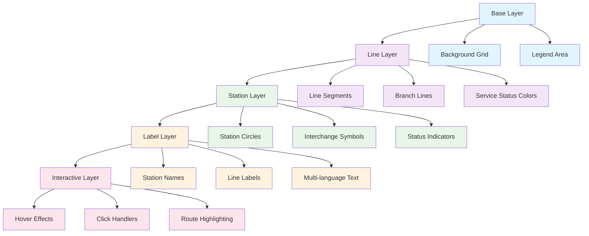
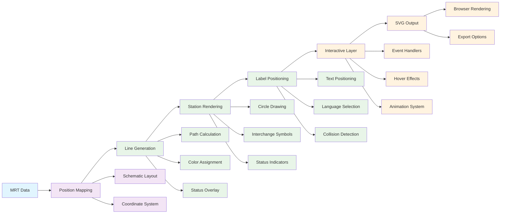

# Chapter 4: Interactive Map System

Fantastic! You now understand how MRT data flows through APIs. Let's create something visual and interactive - the MRT network map! Think of this as creating a "live city map" where users can explore Singapore's transportation network in real-time.

Imagine you're building a subway map for a major city. Instead of a static paper map, you want an interactive digital version that shows real-time train positions, service disruptions, and helps commuters navigate. That's exactly what we're building with the mrtdown map system.

## Map Design Philosophy

The mrtdown map follows schematic design principles:

### 1. Schematic vs Geographic Layout
```typescript
// Traditional geographic map (real coordinates)
const geographicPosition = {
  jurongEast: { lat: 1.3352, lng: 103.7438 },
  cityHall: { lat: 1.293239, lng: 103.852219 }
};

// Schematic map (simplified for clarity)
const schematicPosition = {
  jurongEast: { x: 300, y: 700 },    // Far west
  cityHall: { x: 300, y: 240 }       // City center
};
```

**Why schematic?**
- **Clarity**: Straight lines and right angles are easier to follow
- **Consistency**: Equal spacing between stations regardless of geography
- **Readability**: Reduces visual clutter from real-world curves
- **Usability**: Users can quickly understand line directions

### 2. Layered Architecture
The map is built in layers for optimal performance:



## Core Map Components

Let's explore the key components that make the map interactive:

### 1. SVG-Based Rendering
Using scalable vector graphics for crisp rendering:

```typescript
// src/components/OfficialMRTMap.tsx
const MAP_WIDTH = 1400;
const MAP_HEIGHT = 900;

const OfficialMRTMap = () => {
  return (
    <svg
      width="100%"
      height="600"
      viewBox={`0 0 ${MAP_WIDTH} ${MAP_HEIGHT}`}
      style={{ background: 'linear-gradient(135deg, #f8fafc 0%, #f1f5f9 100%)' }}
    >
      {/* Grid background */}
      <defs>
        <pattern id="grid" width="20" height="20" patternUnits="userSpaceOnUse">
          <path d="M 20 0 L 0 0 0 20" fill="none" stroke="#f0f0f0" strokeWidth="0.5"/>
        </pattern>
      </defs>
      <rect width="100%" height="100%" fill="url(#grid)" />

      {/* MRT Lines and Stations rendered here */}
    </svg>
  );
};
```

### 2. Station Positioning System
Precise coordinate system for all MRT stations:

```typescript
// Schematic positions for all MRT stations
const OFFICIAL_POSITIONS: { [stationId: string]: { x: number; y: number } } = {
  // North-South Line (Red) - Vertical main line
  'JUR': { x: 300, y: 700 },   // Jurong East
  'BBT': { x: 300, y: 680 },   // Bukit Batok
  'BGK': { x: 300, y: 660 },   // Bukit Gombak
  // ... more NSL stations
  'CTH': { x: 300, y: 240 },   // City Hall
  'RFP': { x: 300, y: 220 },   // Raffles Place
  // ... continuing to Marina Bay

  // East-West Line (Green) - Horizontal line
  'PSR': { x: 700, y: 240 },   // Pasir Ris
  'TAM': { x: 680, y: 240 },   // Tampines
  // ... more EWL stations
  'OTP': { x: 260, y: 200 },   // Outram Park
  'BNV': { x: 160, y: 200 },   // Buona Vista
  // ... continuing to Jurong East

  // Circle Line (Orange) - Circular route
  'HBF': { x: 200, y: 150 },   // HarbourFront
  'SER': { x: 380, y: 380 },   // Serangoon
  // ... circular pattern around city

  // Other lines positioned accordingly
};
```

### 3. Line Rendering Algorithm
Drawing MRT lines with proper styling:

```typescript
// Generate line segments between connected stations
const lineSegments = useMemo(() => {
  const segments: Array<{
    from: { x: number; y: number };
    to: { x: number; y: number };
    color: string;
    lineId: string;
  }> = [];

  // North-South Line connections
  const nslStations = ['JUR', 'BBT', 'BGK', 'CCK', 'YWT', 'KRJ', 'MSL', 'WDL',
                       'ADM', 'SBW', 'CBR', 'YIS', 'KTB', 'YCK', 'AMK', 'BSH',
                       'BDL', 'TPY', 'NOV', 'NEW', 'ORC', 'SOM', 'DBG', 'CTH',
                       'RFP', 'MRB', 'MSP'];

  for (let i = 0; i < nslStations.length - 1; i++) {
    const from = OFFICIAL_POSITIONS[nslStations[i]];
    const to = OFFICIAL_POSITIONS[nslStations[i + 1]];
    if (from && to) {
      segments.push({
        from,
        to,
        color: '#d42e12',  // North-South Line red
        lineId: 'NSL'
      });
    }
  }

  return segments;
}, []);
```

### 4. Interactive Station Components
Clickable station markers with hover effects:

```typescript
// Station circle component
const StationCircle = ({ station, onClick, isHovered }) => {
  const baseRadius = station.isInterchange ? 8 : 5;
  const hoverRadius = station.isInterchange ? 10 : 7;

  return (
    <circle
      cx={station.position.x}
      cy={station.position.y}
      r={isHovered ? hoverRadius : baseRadius}
      fill="white"
      stroke={station.isInterchange ? '#1f2937' : '#6b7280'}
      strokeWidth={station.isInterchange ? 3 : 2}
      className="transition-all duration-200 cursor-pointer"
      onClick={() => onClick(station)}
      onMouseEnter={() => setHoveredStation(station.id)}
      onMouseLeave={() => setHoveredStation(null)}
    />
  );
};
```

## Real-Time Status Integration

The map shows live MRT system status:

### 1. Service Status Indicators
```typescript
// Color-coded line status
const getLineStatusColor = (lineStatus: string) => {
  switch (lineStatus) {
    case 'normal': return line.originalColor;
    case 'disrupted': return '#ef4444';  // Red for disruptions
    case 'maintenance': return '#f59e0b'; // Orange for maintenance
    case 'shutdown': return '#6b7280';   // Gray for shutdown
    default: return line.originalColor;
  }
};
```

### 2. Station Status Display
```typescript
// Station status indicators
const StationStatus = ({ station, issues }) => {
  const hasDisruption = issues.some(issue =>
    issue.affectedStations.includes(station.id)
  );

  if (!hasDisruption) return null;

  return (
    <circle
      cx={station.position.x}
      cy={station.position.y}
      r="12"
      fill="none"
      stroke="#ef4444"
      strokeWidth="2"
      strokeDasharray="4,4"
      className="animate-pulse"
    />
  );
};
```

## Multi-Language Label System

Supporting 4 languages with intelligent positioning:

```typescript
// Multi-language station labels
const StationLabel = ({ station, language }) => {
  const getStationName = (station, language) => {
    if (language === 'en') return station.name;
    if (language === 'zh') return station.name_zh || station.name;
    if (language === 'ms') return station.name_ms || station.name;
    if (language === 'ta') return station.name_ta || station.name;
    return station.name;
  };

  const name = getStationName(station, language);

  return (
    <text
      x={station.position.x + 12}
      y={station.position.y - 2}
      fontSize="10"
      fontWeight={station.isInterchange ? "600" : "500"}
      fill="#374151"
      className="pointer-events-none select-none"
    >
      {name}
    </text>
  );
};
```

## Advanced Interactive Features

### 1. Route Highlighting
```typescript
// Highlight a specific route
const highlightRoute = (fromStation: string, toStation: string) => {
  // Calculate shortest path using MRT network
  const route = calculateShortestRoute(fromStation, toStation);

  // Highlight the route segments
  setHighlightedSegments(route.segments);
  setHighlightedStations(route.stations);
};
```

### 2. Zoom and Pan Controls
```typescript
// Zoom controls
const ZoomControls = () => {
  return (
    <div className="absolute top-4 right-4 flex flex-col gap-2">
      <button
        onClick={() => setZoom(zoom * 1.2)}
        className="w-8 h-8 bg-white rounded shadow hover:bg-gray-50"
      >
        +
      </button>
      <button
        onClick={() => setZoom(zoom / 1.2)}
        className="w-8 h-8 bg-white rounded shadow hover:bg-gray-50"
      >
        -
      </button>
    </div>
  );
};
```

### 3. Legend and Information Panel
```typescript
// Interactive legend
const MapLegend = ({ visibleLines, onLineToggle }) => {
  return (
    <div className="absolute bottom-4 left-4 bg-white p-4 rounded-lg shadow-lg">
      <h3 className="font-semibold mb-3">MRT Lines</h3>
      <div className="space-y-2">
        {visibleLines.map(line => (
          <label key={line.id} className="flex items-center gap-2 cursor-pointer">
            <input
              type="checkbox"
              checked={true}
              onChange={() => onLineToggle(line.id)}
              className="rounded"
            />
            <div
              className="w-4 h-4 rounded"
              style={{ backgroundColor: line.color }}
            />
            <span className="text-sm">{line.name}</span>
          </label>
        ))}
      </div>
    </div>
  );
};
```

## Performance Optimization

### 1. Virtual Scrolling for Large Maps
```typescript
// Only render visible stations
const VisibleStations = ({ stations, viewportBounds }) => {
  const visibleStations = useMemo(() => {
    return stations.filter(station => {
      return station.position.x >= viewportBounds.left &&
             station.position.x <= viewportBounds.right &&
             station.position.y >= viewportBounds.top &&
             station.position.y <= viewportBounds.bottom;
    });
  }, [stations, viewportBounds]);

  return visibleStations.map(station => (
    <StationCircle key={station.id} station={station} />
  ));
};
```

### 2. SVG Optimization
```typescript
// Use SVG symbols for repeated elements
<defs>
  <symbol id="station-circle" viewBox="0 0 20 20">
    <circle cx="10" cy="10" r="8" fill="white" stroke="#374151" strokeWidth="2"/>
  </symbol>
</defs>

{/* Use the symbol */}
<use href="#station-circle" x="300" y="400"/>
```

## Mobile Responsiveness

### 1. Touch Gestures
```typescript
// Touch gesture handling
const TouchControls = () => {
  const [touchStart, setTouchStart] = useState(null);

  const handleTouchStart = (e) => {
    setTouchStart({
      x: e.touches[0].clientX,
      y: e.touches[0].clientY,
      time: Date.now()
    });
  };

  const handleTouchEnd = (e) => {
    if (!touchStart) return;

    const touchEnd = {
      x: e.changedTouches[0].clientX,
      y: e.changedTouches[0].clientY,
      time: Date.now()
    };

    // Detect swipe vs tap
    const deltaX = touchEnd.x - touchStart.x;
    const deltaY = touchEnd.y - touchStart.y;
    const deltaTime = touchEnd.time - touchStart.time;

    if (Math.abs(deltaX) > 50 && deltaTime < 300) {
      // Swipe detected
      handleSwipe(deltaX > 0 ? 'right' : 'left');
    } else if (deltaTime < 200) {
      // Tap detected
      handleTap(touchEnd.x, touchEnd.y);
    }
  };

  return (
    <div
      onTouchStart={handleTouchStart}
      onTouchEnd={handleTouchEnd}
      className="w-full h-full"
    />
  );
};
```

### 2. Responsive Layout
```typescript
// Responsive map sizing
const getResponsiveDimensions = () => {
  const width = window.innerWidth;
  const height = window.innerHeight;

  if (width < 768) {
    // Mobile
    return { width: width - 32, height: 400 };
  } else if (width < 1024) {
    // Tablet
    return { width: width - 64, height: 500 };
  } else {
    // Desktop
    return { width: Math.min(width - 128, 1200), height: 600 };
  }
};
```

## Accessibility Features

### 1. Screen Reader Support
```typescript
// ARIA labels for screen readers
<circle
  cx={station.position.x}
  cy={station.position.y}
  r="6"
  fill="white"
  stroke="#374151"
  strokeWidth="2"
  role="button"
  tabIndex={0}
  aria-label={`${station.name} station on ${station.lines.join(' and ')} lines`}
  onClick={() => handleStationClick(station)}
  onKeyDown={(e) => {
    if (e.key === 'Enter' || e.key === ' ') {
      handleStationClick(station);
    }
  }}
/>
```

### 2. Keyboard Navigation
```typescript
// Keyboard navigation between stations
const handleKeyNavigation = (direction: 'up' | 'down' | 'left' | 'right') => {
  const currentIndex = stations.findIndex(s => s.id === selectedStation);
  let nextIndex = currentIndex;

  switch (direction) {
    case 'up':
      nextIndex = Math.max(0, currentIndex - 10); // Move north
      break;
    case 'down':
      nextIndex = Math.min(stations.length - 1, currentIndex + 10); // Move south
      break;
    case 'left':
      nextIndex = Math.max(0, currentIndex - 1); // Move west
      break;
    case 'right':
      nextIndex = Math.min(stations.length - 1, currentIndex + 1); // Move east
      break;
  }

  setSelectedStation(stations[nextIndex].id);
};
```

## How it Works Under the Hood

The map rendering pipeline operates in stages:



## Integration with React Ecosystem

### 1. State Management
```typescript
// Global map state using React Context
const MapContext = createContext();

const MapProvider = ({ children }) => {
  const [selectedStation, setSelectedStation] = useState(null);
  const [hoveredStation, setHoveredStation] = useState(null);
  const [visibleLines, setVisibleLines] = useState(['NSL', 'EWL', 'CCL', 'NEL', 'DTL', 'TEL']);
  const [zoom, setZoom] = useState(1);
  const [pan, setPan] = useState({ x: 0, y: 0 });

  return (
    <MapContext.Provider value={{
      selectedStation,
      setSelectedStation,
      hoveredStation,
      setHoveredStation,
      visibleLines,
      setVisibleLines,
      zoom,
      setZoom,
      pan,
      setPan
    }}>
      {children}
    </MapContext.Provider>
  );
};
```

### 2. Custom Hooks
```typescript
// Custom hook for station interactions
const useStationInteraction = () => {
  const { selectedStation, setSelectedStation } = useContext(MapContext);
  const { data: stationData } = useQuery(['station', selectedStation], () =>
    fetch(`/api/stations/${selectedStation}`).then(res => res.json())
  );

  const selectStation = (stationId) => {
    setSelectedStation(stationId);
    // Track analytics
    trackEvent('station_selected', { stationId });
  };

  return { selectedStation, stationData, selectStation };
};
```

## Export and Sharing Features

### 1. SVG Export
```typescript
// Export map as SVG file
const exportSVG = () => {
  const svgElement = document.getElementById('mrt-map');
  const svgString = new XMLSerializer().serializeToString(svgElement);

  const blob = new Blob([svgString], { type: 'image/svg+xml' });
  const url = URL.createObjectURL(blob);

  const a = document.createElement('a');
  a.href = url;
  a.download = 'singapore-mrt-map.svg';
  a.click();

  URL.revokeObjectURL(url);
};
```

### 2. Image Export
```typescript
// Convert SVG to PNG for sharing
const exportPNG = async () => {
  const svgElement = document.getElementById('mrt-map');
  const canvas = document.createElement('canvas');
  const ctx = canvas.getContext('2d');

  // Set canvas size
  canvas.width = MAP_WIDTH;
  canvas.height = MAP_HEIGHT;

  // Convert SVG to image
  const img = new Image();
  img.onload = () => {
    ctx.drawImage(img, 0, 0);
    canvas.toBlob((blob) => {
      const url = URL.createObjectURL(blob);
      const a = document.createElement('a');
      a.href = url;
      a.download = 'singapore-mrt-map.png';
      a.click();
    });
  };

  img.src = 'data:image/svg+xml;base64,' + btoa(svgString);
};
```

## Key Takeaways

- **Schematic Design**: Simplified layout for clarity and usability
- **Interactive Layers**: Hover effects, click handlers, and real-time updates
- **Performance Optimized**: Virtual scrolling and SVG optimization
- **Accessibility First**: Screen reader support and keyboard navigation
- **Mobile Responsive**: Touch gestures and responsive layouts
- **Export Ready**: Multiple format support for sharing and printing

---

## What's Next?

With our interactive map complete, let's build the public dashboard! In [Chapter 5](./05_realtime_status.md), we'll create the real-time status monitoring system that shows live MRT system health.

> 💡 **Pro tip**: Think of the MRT map like a city's nervous system. Just as nerves carry signals throughout the body, MRT lines carry trains throughout the city. The map visualizes this system, showing where everything is and how it's performing.
