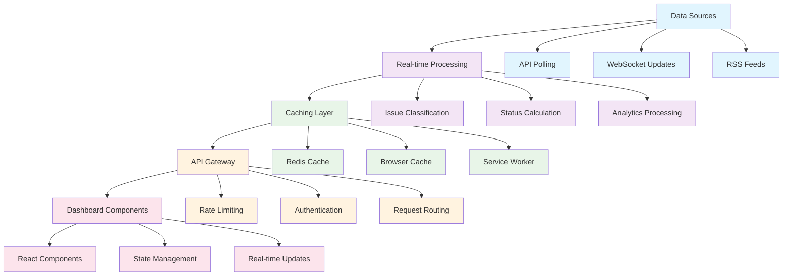

# Chapter 5: Real-Time Status Dashboard

Excellent! You now have an interactive MRT map. Let's build the beating heart of mrtdown - the real-time status dashboard! Think of this as creating a "mission control center" for Singapore's MRT system, where you can monitor the health of every line, station, and train in real-time.

Imagine you're the operations manager for Singapore's MRT network. You need to know instantly when a signal fails, when maintenance is scheduled, and how passengers are being affected. That's exactly what this dashboard provides - comprehensive, real-time visibility into the entire MRT ecosystem.

## Dashboard Design Philosophy

The mrtdown dashboard follows these core principles:

### 1. Information Hierarchy
```typescript
// Most critical information at the top
const DashboardLayout = () => {
  return (
    <div className="dashboard">
      {/* Critical alerts - always visible */}
      <EmergencyAlerts />

      {/* System overview - high level status */}
      <SystemOverview />

      {/* Line-by-line status - detailed breakdown */}
      <LineStatusGrid />

      {/* Station details - drill-down capability */}
      <StationDetails />
    </div>
  );
};
```

### 2. Progressive Disclosure
```typescript
// Show summary first, details on demand
const LineStatusCard = ({ line }) => {
  const [expanded, setExpanded] = useState(false);

  return (
    <Card>
      {/* Summary view */}
      <div className="flex justify-between items-center">
        <div className="flex items-center gap-3">
          <div
            className="w-4 h-4 rounded"
            style={{ backgroundColor: line.color }}
          />
          <span className="font-semibold">{line.name}</span>
          <StatusBadge status={line.status} />
        </div>
        <button onClick={() => setExpanded(!expanded)}>
          {expanded ? 'Less' : 'More'}
        </button>
      </div>

      {/* Detailed view - only when expanded */}
      {expanded && <LineDetails line={line} />}
    </Card>
  );
};
```

## Core Dashboard Components

Let's explore the key components that make the dashboard effective:

### 1. System Health Overview
The "big picture" view of MRT system health:

```typescript
// src/components/SystemOverview.tsx
const SystemOverview = () => {
  const { data: overview, isLoading } = useQuery({
    queryKey: ['system-overview'],
    queryFn: () => fetch('/api/overview').then(res => res.json()),
    refetchInterval: 30000 // Refresh every 30 seconds
  });

  if (isLoading) {
    return <LoadingSkeleton />;
  }

  const systemHealth = calculateSystemHealth(overview);

  return (
    <div className="grid grid-cols-1 md:grid-cols-4 gap-6 mb-8">
      {/* Overall System Status */}
      <Card className="md:col-span-2">
        <div className="flex items-center justify-between">
          <div>
            <h2 className="text-2xl font-bold">System Status</h2>
            <p className="text-gray-600">All MRT lines operational</p>
          </div>
          <div className={`w-6 h-6 rounded-full ${
            systemHealth === 'healthy' ? 'bg-green-500' :
            systemHealth === 'warning' ? 'bg-yellow-500' :
            'bg-red-500'
          }`} />
        </div>
      </Card>

      {/* Active Issues Count */}
      <Card>
        <div className="text-center">
          <div className="text-3xl font-bold text-red-600">
            {overview.activeIssues}
          </div>
          <div className="text-sm text-gray-600">Active Issues</div>
        </div>
      </Card>

      {/* Lines Operational */}
      <Card>
        <div className="text-center">
          <div className="text-3xl font-bold text-green-600">
            {overview.lines.filter(l => l.status === 'normal').length}
          </div>
          <div className="text-sm text-gray-600">Lines Normal</div>
        </div>
      </Card>
    </div>
  );
};
```

### 2. Emergency Alert System
Critical notifications that demand immediate attention:

```typescript
// src/components/EmergencyAlerts.tsx
const EmergencyAlerts = () => {
  const { data: alerts } = useQuery({
    queryKey: ['emergency-alerts'],
    queryFn: () => fetch('/api/issues?severity=critical&status=active'),
    refetchInterval: 10000 // Refresh every 10 seconds
  });

  if (!alerts || alerts.length === 0) return null;

  return (
    <div className="mb-6">
      {alerts.map(alert => (
        <Alert key={alert.id} variant="destructive" className="animate-pulse">
          <AlertTriangle className="h-4 w-4" />
          <AlertTitle>Critical Alert: {alert.title}</AlertTitle>
          <AlertDescription>
            {alert.description}
            <br />
            <strong>Affected:</strong> {alert.affectedLines.join(', ')}
            <br />
            <strong>Started:</strong> {formatTime(alert.timeInterval.start)}
          </AlertDescription>
        </Alert>
      ))}
    </div>
  );
};
```

### 3. Line Status Grid
Detailed status for each MRT line:

```typescript
// src/components/LineStatusGrid.tsx
const LineStatusGrid = () => {
  const { data: lines } = useQuery({
    queryKey: ['lines-status'],
    queryFn: () => fetch('/api/lines'),
    refetchInterval: 30000
  });

  return (
    <div className="grid grid-cols-1 md:grid-cols-2 lg:grid-cols-3 gap-4 mb-8">
      {lines.map(line => (
        <LineStatusCard key={line.id} line={line} />
      ))}
    </div>
  );
};

const LineStatusCard = ({ line }) => {
  const statusColor = {
    normal: 'bg-green-500',
    disrupted: 'bg-red-500',
    maintenance: 'bg-yellow-500',
    shutdown: 'bg-gray-500'
  }[line.status] || 'bg-gray-500';

  return (
    <Card className="p-4 hover:shadow-lg transition-shadow">
      <div className="flex items-center justify-between mb-3">
        <div className="flex items-center gap-3">
          <div
            className="w-5 h-5 rounded"
            style={{ backgroundColor: line.color }}
          />
          <div>
            <h3 className="font-semibold">{line.name}</h3>
            <p className="text-sm text-gray-600">{line.id}</p>
          </div>
        </div>
        <div className={`w-3 h-3 rounded-full ${statusColor}`} />
      </div>

      <div className="space-y-2">
        <div className="flex justify-between text-sm">
          <span>Uptime (24h)</span>
          <span className="font-mono">{(line.uptime * 100).toFixed(1)}%</span>
        </div>
        <div className="flex justify-between text-sm">
          <span>Active Issues</span>
          <span className={line.activeIssues > 0 ? 'text-red-600 font-semibold' : ''}>
            {line.activeIssues}
          </span>
        </div>
        <div className="flex justify-between text-sm">
          <span>Next Maintenance</span>
          <span className="font-mono">{line.nextMaintenance || 'None'}</span>
        </div>
      </div>

      {line.activeIssues > 0 && (
        <div className="mt-3 pt-3 border-t">
          <h4 className="text-sm font-semibold mb-2">Current Issues:</h4>
          <div className="space-y-1">
            {line.currentIssues.map(issue => (
              <div key={issue.id} className="text-xs bg-red-50 p-2 rounded">
                <div className="font-medium">{issue.title}</div>
                <div className="text-gray-600">{issue.description}</div>
              </div>
            ))}
          </div>
        </div>
      )}
    </Card>
  );
};
```

### 4. Real-Time Updates System
WebSocket-based live updates:

```typescript
// src/hooks/useRealtimeUpdates.ts
const useRealtimeUpdates = () => {
  const [updates, setUpdates] = useState([]);
  const [connectionStatus, setConnectionStatus] = useState('connecting');

  useEffect(() => {
    const ws = new WebSocket('wss://api.mrtdown.sg/updates');

    ws.onopen = () => {
      setConnectionStatus('connected');
    };

    ws.onmessage = (event) => {
      const update = JSON.parse(event.data);
      setUpdates(prev => [update, ...prev.slice(0, 49)]); // Keep last 50 updates

      // Show notification for critical updates
      if (update.severity === 'critical') {
        showNotification(update);
      }
    };

    ws.onclose = () => {
      setConnectionStatus('disconnected');
      // Attempt reconnection after delay
      setTimeout(() => {
        // Reconnection logic
      }, 5000);
    };

    return () => ws.close();
  }, []);

  return { updates, connectionStatus };
};
```

### 5. Station Status Monitor
Detailed view of individual stations:

```typescript
// src/components/StationMonitor.tsx
const StationMonitor = ({ stationId }) => {
  const { data: station } = useQuery({
    queryKey: ['station', stationId],
    queryFn: () => fetch(`/api/stations/${stationId}`),
    refetchInterval: 60000 // Refresh every minute
  });

  const { data: crowdLevel } = useQuery({
    queryKey: ['station-crowd', stationId],
    queryFn: () => fetch(`/api/stations/${stationId}/crowd-level`),
    refetchInterval: 300000 // Refresh every 5 minutes
  });

  return (
    <Card className="p-6">
      <div className="flex items-center justify-between mb-4">
        <div>
          <h3 className="text-xl font-bold">{station.name}</h3>
          <p className="text-gray-600">Station Code: {station.codes.join(', ')}</p>
        </div>
        <CrowdLevelIndicator level={crowdLevel} />
      </div>

      {/* Real-time platform information */}
      <div className="grid grid-cols-1 md:grid-cols-2 gap-4">
        {station.platforms.map(platform => (
          <PlatformCard key={platform.id} platform={platform} />
        ))}
      </div>

      {/* Station facilities */}
      <div className="mt-4">
        <h4 className="font-semibold mb-2">Facilities</h4>
        <div className="flex flex-wrap gap-2">
          {station.facilities.map(facility => (
            <Badge key={facility} variant="secondary">
              {facility}
            </Badge>
          ))}
        </div>
      </div>
    </Card>
  );
};

const PlatformCard = ({ platform }) => {
  const nextTrains = platform.nextTrains || [];

  return (
    <div className="border rounded-lg p-3">
      <div className="flex items-center justify-between mb-2">
        <span className="font-semibold">Platform {platform.number}</span>
        <Badge variant={platform.status === 'operational' ? 'default' : 'destructive'}>
          {platform.status}
        </Badge>
      </div>

      <div className="space-y-1">
        <div className="text-sm text-gray-600">Next trains:</div>
        {nextTrains.slice(0, 3).map((train, index) => (
          <div key={index} className="flex justify-between text-sm">
            <span>{train.destination}</span>
            <span className="font-mono">{train.arrivalTime}</span>
          </div>
        ))}
      </div>
    </div>
  );
};
```

## Advanced Dashboard Features

### 1. Predictive Analytics
Machine learning-powered predictions:

```typescript
// src/components/PredictiveAlerts.tsx
const PredictiveAlerts = () => {
  const { data: predictions } = useQuery({
    queryKey: ['predictions'],
    queryFn: () => fetch('/api/analytics/predictions'),
    refetchInterval: 300000 // Refresh every 5 minutes
  });

  return (
    <Card className="p-4">
      <h3 className="text-lg font-semibold mb-4 flex items-center gap-2">
        <TrendingUp className="w-5 h-5" />
        Predictive Analytics
      </h3>

      <div className="space-y-3">
        {predictions.map(prediction => (
          <div key={prediction.id} className="flex items-center justify-between p-3 bg-yellow-50 rounded-lg">
            <div className="flex items-center gap-3">
              <AlertTriangle className="w-4 h-4 text-yellow-600" />
              <div>
                <div className="font-medium">{prediction.title}</div>
                <div className="text-sm text-gray-600">{prediction.description}</div>
              </div>
            </div>
            <div className="text-right">
              <div className="text-sm font-medium">Confidence</div>
              <div className="text-lg font-bold text-yellow-600">
                {(prediction.confidence * 100).toFixed(0)}%
              </div>
            </div>
          </div>
        ))}
      </div>
    </Card>
  );
};
```

### 2. Historical Trend Charts
Visualizing performance over time:

```typescript
// src/components/UptimeChart.tsx
const UptimeChart = ({ lineId, timeRange }) => {
  const { data: uptimeData } = useQuery({
    queryKey: ['uptime-chart', lineId, timeRange],
    queryFn: () => fetch(`/api/analytics/uptime/${lineId}?range=${timeRange}`)
  });

  const chartData = uptimeData.map(point => ({
    time: new Date(point.timestamp),
    uptime: point.uptime * 100,
    incidents: point.incidents
  }));

  return (
    <Card className="p-6">
      <h3 className="text-lg font-semibold mb-4">Uptime Trend</h3>
      <ResponsiveContainer width="100%" height={300}>
        <LineChart data={chartData}>
          <CartesianGrid strokeDasharray="3 3" />
          <XAxis
            dataKey="time"
            tickFormatter={(time) => format(time, 'HH:mm')}
          />
          <YAxis domain={[90, 100]} />
          <Tooltip
            formatter={(value, name) => [
              name === 'uptime' ? `${value.toFixed(1)}%` : value,
              name === 'uptime' ? 'Uptime' : 'Incidents'
            ]}
          />
          <Line
            type="monotone"
            dataKey="uptime"
            stroke="#10b981"
            strokeWidth={3}
            dot={false}
          />
          <Bar
            dataKey="incidents"
            fill="#ef4444"
            opacity={0.3}
          />
        </LineChart>
      </ResponsiveContainer>
    </Card>
  );
};
```

### 3. Incident Timeline
Chronological view of system events:

```typescript
// src/components/IncidentTimeline.tsx
const IncidentTimeline = () => {
  const { data: incidents } = useQuery({
    queryKey: ['incident-timeline'],
    queryFn: () => fetch('/api/issues?limit=50&sort=-created_at')
  });

  return (
    <Card className="p-6">
      <h3 className="text-lg font-semibold mb-4">Recent Incidents</h3>
      <div className="space-y-4">
        {incidents.map((incident, index) => (
          <div key={incident.id} className="flex gap-4">
            {/* Timeline line */}
            <div className="flex flex-col items-center">
              <div className={`w-3 h-3 rounded-full ${
                incident.severity === 'critical' ? 'bg-red-500' :
                incident.severity === 'high' ? 'bg-orange-500' :
                'bg-yellow-500'
              }`} />
              {index < incidents.length - 1 && (
                <div className="w-px h-16 bg-gray-300 mt-2" />
              )}
            </div>

            {/* Incident details */}
            <div className="flex-1 pb-8">
              <div className="flex items-center justify-between mb-2">
                <h4 className="font-medium">{incident.title}</h4>
                <Badge variant={
                  incident.severity === 'critical' ? 'destructive' :
                  incident.severity === 'high' ? 'default' :
                  'secondary'
                }>
                  {incident.severity}
                </Badge>
              </div>

              <p className="text-sm text-gray-600 mb-2">
                {incident.description}
              </p>

              <div className="flex items-center gap-4 text-xs text-gray-500">
                <span>Affected: {incident.affectedLines.join(', ')}</span>
                <span>Duration: {calculateDuration(incident)}</span>
                <span>{formatTime(incident.created_at)}</span>
              </div>
            </div>
          </div>
        ))}
      </div>
    </Card>
  );
};
```

## Mobile Dashboard Experience

### 1. Responsive Design
```typescript
// src/components/MobileDashboard.tsx
const MobileDashboard = () => {
  const [activeTab, setActiveTab] = useState('overview');

  return (
    <div className="min-h-screen bg-gray-50">
      {/* Status bar */}
      <div className="bg-white border-b px-4 py-3">
        <div className="flex items-center justify-between">
          <h1 className="text-lg font-bold">MRT Status</h1>
          <div className="flex items-center gap-2">
            <div className="w-2 h-2 bg-green-500 rounded-full animate-pulse" />
            <span className="text-sm text-gray-600">Live</span>
          </div>
        </div>
      </div>

      {/* Emergency alerts - always visible */}
      <EmergencyAlerts />

      {/* Tab navigation */}
      <div className="bg-white border-b">
        <div className="flex">
          {[
            { id: 'overview', label: 'Overview', icon: Home },
            { id: 'lines', label: 'Lines', icon: Train },
            { id: 'alerts', label: 'Alerts', icon: AlertTriangle },
            { id: 'map', label: 'Map', icon: Map }
          ].map(tab => (
            <button
              key={tab.id}
              onClick={() => setActiveTab(tab.id)}
              className={`flex-1 py-3 px-2 text-center text-sm font-medium ${
                activeTab === tab.id
                  ? 'text-blue-600 border-b-2 border-blue-600'
                  : 'text-gray-600'
              }`}
            >
              <tab.icon className="w-4 h-4 mx-auto mb-1" />
              {tab.label}
            </button>
          ))}
        </div>
      </div>

      {/* Tab content */}
      <div className="p-4">
        {activeTab === 'overview' && <MobileOverview />}
        {activeTab === 'lines' && <MobileLines />}
        {activeTab === 'alerts' && <MobileAlerts />}
        {activeTab === 'map' && <MobileMap />}
      </div>
    </div>
  );
};
```

### 2. Push Notifications
```typescript
// src/hooks/usePushNotifications.ts
const usePushNotifications = () => {
  const [permission, setPermission] = useState('default');

  useEffect(() => {
    if ('Notification' in window) {
      setPermission(Notification.permission);
    }
  }, []);

  const requestPermission = async () => {
    if ('Notification' in window) {
      const result = await Notification.requestPermission();
      setPermission(result);
      return result;
    }
    return 'denied';
  };

  const sendNotification = (title: string, body: string, options?: NotificationOptions) => {
    if (permission === 'granted') {
      new Notification(title, {
        body,
        icon: '/favicon.ico',
        badge: '/badge.png',
        ...options
      });
    }
  };

  return { permission, requestPermission, sendNotification };
};
```

## Performance Optimization

### 1. Data Caching Strategy
```typescript
// src/hooks/useDashboardData.ts
const useDashboardData = () => {
  // Cache frequently accessed data
  const overviewQuery = useQuery({
    queryKey: ['overview'],
    queryFn: () => fetch('/api/overview'),
    staleTime: 30000, // Consider data fresh for 30 seconds
    cacheTime: 300000 // Keep in cache for 5 minutes
  });

  // Background refetch for critical data
  const criticalQuery = useQuery({
    queryKey: ['critical-issues'],
    queryFn: () => fetch('/api/issues?severity=critical'),
    refetchInterval: 15000, // Refetch every 15 seconds
    refetchIntervalInBackground: true
  });

  return { overviewQuery, criticalQuery };
};
```

### 2. Lazy Loading
```typescript
// src/components/LazyLineDetails.tsx
const LazyLineDetails = ({ lineId }) => {
  const [isExpanded, setIsExpanded] = useState(false);

  return (
    <div>
      <button
        onClick={() => setIsExpanded(true)}
        className="text-blue-600 hover:text-blue-800"
      >
        Show Details
      </button>

      {isExpanded && (
        <Suspense fallback={<LoadingSpinner />}>
          <LineDetails lineId={lineId} />
        </Suspense>
      )}
    </div>
  );
};
```

## How it Works Under the Hood

The dashboard operates through multiple data streams:



## Key Takeaways

- **Real-time Updates**: WebSocket connections and polling ensure live data
- **Progressive Disclosure**: Summary first, details on demand
- **Mobile-First**: Responsive design with push notifications
- **Performance Optimized**: Caching, lazy loading, and efficient queries
- **User-Centric**: Clear status indicators and emergency alerts
- **Predictive**: AI-powered insights and trend analysis

---

## What's Next?

With our real-time dashboard running, let's dive into the analytical side of things. In [Chapter 6](./06_historical_analytics.md), we'll build the historical analytics system that helps understand long-term MRT performance trends!

> 💡 **Pro tip**: Think of the real-time dashboard as an airplane cockpit. Just like pilots need to monitor dozens of instruments simultaneously, MRT operators need to track multiple lines, stations, and incidents in real-time to ensure smooth operations.
