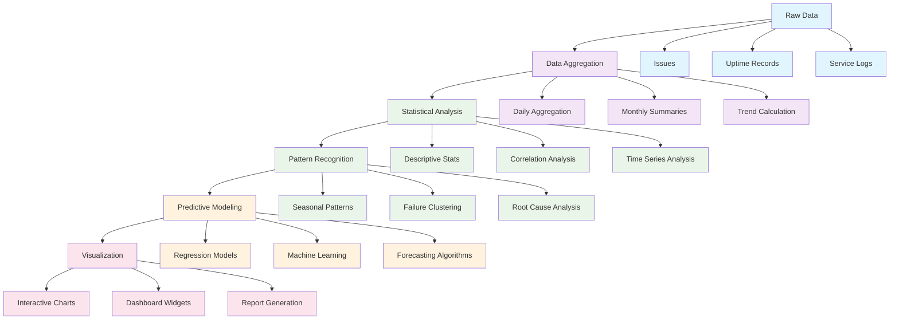

# Chapter 6: Historical Analytics

Fantastic! You now have a real-time MRT monitoring dashboard. Let's explore the analytical side of mrtdown - historical analytics that reveal patterns, trends, and insights from months and years of MRT data. Think of this as a "time machine" that lets you analyze past performance to predict future issues and improve service quality.

Imagine you're an MRT system analyst studying transportation patterns over the past 5 years. You want to know: Which lines are most reliable? When do disruptions typically occur? How has passenger demand changed? That's exactly what historical analytics provides - deep insights into MRT system performance over time.

## Analytics Architecture

The historical analytics system is built on several key components:

### 1. Data Aggregation Pipeline
Collecting and organizing historical data:

```typescript
// src/analytics/dataAggregator.ts
class DataAggregator {
  // Aggregate daily statistics
  async aggregateDailyStats(date: Date) {
    const dayStart = new Date(date);
    dayStart.setHours(0, 0, 0, 0);

    const dayEnd = new Date(date);
    dayEnd.setHours(23, 59, 59, 999);

    // Get all issues for the day
    const issues = await this.db.query(`
      SELECT * FROM issues
      WHERE time_interval && $1
      ORDER BY created_at
    `, [[dayStart, dayEnd]]);

    // Calculate daily metrics
    const dailyStats = {
      date: date.toISOString().split('T')[0],
      totalIssues: issues.length,
      bySeverity: this.groupBySeverity(issues),
      byType: this.groupByType(issues),
      byLine: this.groupByLine(issues),
      uptimeByLine: await this.calculateUptimeByLine(date),
      averageDelay: this.calculateAverageDelay(issues),
      peakHours: this.identifyPeakHours(issues)
    };

    // Store aggregated data
    await this.db.insert('daily_stats', dailyStats);
    return dailyStats;
  }
}
```

### 2. Time Series Database Design
Efficient storage for time-series analytics:

```sql
-- Historical analytics tables
CREATE TABLE daily_stats (
  date DATE PRIMARY KEY,
  total_issues INTEGER,
  by_severity JSONB,
  by_type JSONB,
  by_line JSONB,
  uptime_by_line JSONB,
  average_delay INTEGER,
  peak_hours JSONB,
  created_at TIMESTAMP DEFAULT CURRENT_TIMESTAMP
);

CREATE TABLE monthly_aggregates (
  year INTEGER,
  month INTEGER,
  total_issues INTEGER,
  average_uptime REAL,
  most_affected_line TEXT,
  total_downtime_minutes INTEGER,
  PRIMARY KEY (year, month)
);

CREATE TABLE trend_analysis (
  line_id TEXT,
  time_period TEXT,
  metric TEXT,
  value REAL,
  trend TEXT, -- 'improving', 'worsening', 'stable'
  confidence REAL,
  created_at TIMESTAMP DEFAULT CURRENT_TIMESTAMP
);
```

## Core Analytics Features

Let's explore the key analytical capabilities:

### 1. Uptime Analysis Dashboard
Comprehensive uptime tracking across all lines:

```typescript
// src/components/analytics/UptimeDashboard.tsx
const UptimeDashboard = () => {
  const [timeRange, setTimeRange] = useState('30d');
  const [selectedLines, setSelectedLines] = useState(['NSL', 'EWL', 'CCL']);

  const { data: uptimeData } = useQuery({
    queryKey: ['uptime-analytics', timeRange, selectedLines],
    queryFn: () => fetch(`/api/analytics/uptime?range=${timeRange}&lines=${selectedLines.join(',')}`)
  });

  return (
    <div className="space-y-6">
      {/* Time range selector */}
      <div className="flex gap-4">
        {['7d', '30d', '90d', '1y'].map(range => (
          <button
            key={range}
            onClick={() => setTimeRange(range)}
            className={`px-4 py-2 rounded ${
              timeRange === range ? 'bg-blue-600 text-white' : 'bg-gray-200'
            }`}
          >
            {range === '7d' ? '7 Days' :
             range === '30d' ? '30 Days' :
             range === '90d' ? '90 Days' : '1 Year'}
          </button>
        ))}
      </div>

      {/* Overall uptime summary */}
      <div className="grid grid-cols-1 md:grid-cols-3 gap-6">
        <Card>
          <div className="text-center">
            <div className="text-3xl font-bold text-green-600">
              {uptimeData?.overall?.toFixed(1)}%
            </div>
            <div className="text-sm text-gray-600">Overall Uptime</div>
          </div>
        </Card>

        <Card>
          <div className="text-center">
            <div className="text-3xl font-bold text-blue-600">
              {uptimeData?.bestLine}
            </div>
            <div className="text-sm text-gray-600">Best Performing Line</div>
          </div>
        </Card>

        <Card>
          <div className="text-center">
            <div className="text-3xl font-bold text-red-600">
              {uptimeData?.worstLine}
            </div>
            <div className="text-sm text-gray-600">Most Affected Line</div>
          </div>
        </Card>
      </div>

      {/* Uptime trend chart */}
      <Card className="p-6">
        <h3 className="text-lg font-semibold mb-4">Uptime Trends</h3>
        <ResponsiveContainer width="100%" height={400}>
          <LineChart data={uptimeData?.chartData}>
            <CartesianGrid strokeDasharray="3 3" />
            <XAxis dataKey="date" />
            <YAxis domain={[90, 100]} />
            <Tooltip formatter={(value) => `${value.toFixed(1)}%`} />
            <Legend />
            {selectedLines.map((lineId, index) => (
              <Line
                key={lineId}
                type="monotone"
                dataKey={lineId}
                stroke={LINE_COLORS[lineId]}
                strokeWidth={2}
                dot={false}
              />
            ))}
          </LineChart>
        </ResponsiveContainer>
      </Card>

      {/* Line-by-line uptime table */}
      <Card className="p-6">
        <h3 className="text-lg font-semibold mb-4">Line Performance</h3>
        <div className="overflow-x-auto">
          <table className="w-full">
            <thead>
              <tr className="border-b">
                <th className="text-left py-2">Line</th>
                <th className="text-right py-2">Uptime</th>
                <th className="text-right py-2">Issues</th>
                <th className="text-right py-2">Avg Delay</th>
                <th className="text-right py-2">Trend</th>
              </tr>
            </thead>
            <tbody>
              {uptimeData?.lines?.map(line => (
                <tr key={line.id} className="border-b">
                  <td className="py-3">
                    <div className="flex items-center gap-2">
                      <div
                        className="w-4 h-4 rounded"
                        style={{ backgroundColor: LINE_COLORS[line.id] }}
                      />
                      {line.name}
                    </div>
                  </td>
                  <td className="text-right font-mono">
                    {line.uptime.toFixed(1)}%
                  </td>
                  <td className="text-right">{line.totalIssues}</td>
                  <td className="text-right font-mono">
                    {line.avgDelay}min
                  </td>
                  <td className="text-right">
                    <TrendIndicator trend={line.trend} />
                  </td>
                </tr>
              ))}
            </tbody>
          </table>
        </div>
      </Card>
    </div>
  );
};
```

### 2. Issue Pattern Analysis
Understanding when and why disruptions occur:

```typescript
// src/components/analytics/IssuePatterns.tsx
const IssuePatterns = () => {
  const { data: patternData } = useQuery({
    queryKey: ['issue-patterns'],
    queryFn: () => fetch('/api/analytics/patterns')
  });

  return (
    <div className="grid grid-cols-1 lg:grid-cols-2 gap-6">
      {/* Issues by time of day */}
      <Card className="p-6">
        <h3 className="text-lg font-semibold mb-4">Issues by Time of Day</h3>
        <ResponsiveContainer width="100%" height={300}>
          <BarChart data={patternData?.byHour}>
            <CartesianGrid strokeDasharray="3 3" />
            <XAxis dataKey="hour" />
            <YAxis />
            <Tooltip />
            <Bar dataKey="count" fill="#ef4444" />
          </BarChart>
        </ResponsiveContainer>
      </Card>

      {/* Issues by day of week */}
      <Card className="p-6">
        <h3 className="text-lg font-semibold mb-4">Issues by Day of Week</h3>
        <ResponsiveContainer width="100%" height={300}>
          <BarChart data={patternData?.byDayOfWeek}>
            <CartesianGrid strokeDasharray="3 3" />
            <XAxis dataKey="day" />
            <YAxis />
            <Tooltip />
            <Bar dataKey="count" fill="#f59e0b" />
          </BarChart>
        </ResponsiveContainer>
      </Card>

      {/* Issues by type */}
      <Card className="p-6">
        <h3 className="text-lg font-semibold mb-4">Issues by Type</h3>
        <ResponsiveContainer width="100%" height={300}>
          <PieChart>
            <Pie
              data={patternData?.byType}
              cx="50%"
              cy="50%"
              outerRadius={80}
              dataKey="count"
              label={({ name, percent }) => `${name} ${(percent * 100).toFixed(0)}%`}
            >
              {patternData?.byType?.map((entry, index) => (
                <Cell key={`cell-${index}`} fill={COLORS[index % COLORS.length]} />
              ))}
            </Pie>
            <Tooltip />
          </PieChart>
        </ResponsiveContainer>
      </Card>

      {/* Most affected stations */}
      <Card className="p-6">
        <h3 className="text-lg font-semibold mb-4">Most Affected Stations</h3>
        <div className="space-y-3">
          {patternData?.topStations?.map((station, index) => (
            <div key={station.id} className="flex items-center justify-between">
              <div className="flex items-center gap-3">
                <div className="w-8 h-8 rounded-full bg-gray-100 flex items-center justify-center text-sm font-medium">
                  {index + 1}
                </div>
                <div>
                  <div className="font-medium">{station.name}</div>
                  <div className="text-sm text-gray-600">{station.line}</div>
                </div>
              </div>
              <div className="text-right">
                <div className="font-semibold">{station.issueCount}</div>
                <div className="text-sm text-gray-600">issues</div>
              </div>
            </div>
          ))}
        </div>
      </Card>
    </div>
  );
};
```

### 3. Predictive Analytics Engine
Machine learning-powered predictions:

```typescript
// src/analytics/predictiveEngine.ts
class PredictiveEngine {
  // Predict future disruptions based on historical patterns
  async predictDisruptions(timeframe: string) {
    const historicalData = await this.getHistoricalData(timeframe);
    const patterns = await this.analyzePatterns(historicalData);

    const predictions = [];

    for (const pattern of patterns) {
      if (pattern.confidence > 0.7) {
        predictions.push({
          type: pattern.type,
          location: pattern.location,
          predictedTime: pattern.nextOccurrence,
          confidence: pattern.confidence,
          contributingFactors: pattern.factors,
          recommendedActions: await this.generateRecommendations(pattern)
        });
      }
    }

    return predictions;
  }

  // Analyze seasonal patterns
  async analyzeSeasonalPatterns() {
    const seasonalData = await this.db.query(`
      SELECT
        EXTRACT(MONTH FROM created_at) as month,
        EXTRACT(HOUR FROM created_at) as hour,
        type,
        severity,
        COUNT(*) as count
      FROM issues
      WHERE created_at >= NOW() - INTERVAL '2 years'
      GROUP BY month, hour, type, severity
      ORDER BY count DESC
    `);

    return this.clusterPatterns(seasonalData);
  }
}
```

## Advanced Analytics Features

### 1. Comparative Analysis
Comparing performance across different time periods:

```typescript
// src/components/analytics/ComparativeAnalysis.tsx
const ComparativeAnalysis = () => {
  const [baselinePeriod, setBaselinePeriod] = useState('last_month');
  const [comparisonPeriod, setComparisonPeriod] = useState('this_month');

  const { data: comparison } = useQuery({
    queryKey: ['comparison', baselinePeriod, comparisonPeriod],
    queryFn: () => fetch(`/api/analytics/compare?baseline=${baselinePeriod}&comparison=${comparisonPeriod}`)
  });

  return (
    <Card className="p-6">
      <div className="flex items-center justify-between mb-6">
        <h3 className="text-lg font-semibold">Performance Comparison</h3>
        <div className="flex gap-4">
          <select
            value={baselinePeriod}
            onChange={(e) => setBaselinePeriod(e.target.value)}
            className="border rounded px-3 py-1"
          >
            <option value="last_month">Last Month</option>
            <option value="last_quarter">Last Quarter</option>
            <option value="last_year">Last Year</option>
          </select>
          <span className="text-gray-500">vs</span>
          <select
            value={comparisonPeriod}
            onChange={(e) => setComparisonPeriod(e.target.value)}
            className="border rounded px-3 py-1"
          >
            <option value="this_month">This Month</option>
            <option value="this_quarter">This Quarter</option>
            <option value="this_year">This Year</option>
          </select>
        </div>
      </div>

      <div className="grid grid-cols-1 md:grid-cols-2 lg:grid-cols-4 gap-4 mb-6">
        <MetricCard
          title="Uptime Change"
          value={comparison?.uptimeChange}
          format="percentage"
          trend={comparison?.uptimeTrend}
        />
        <MetricCard
          title="Issue Count Change"
          value={comparison?.issueCountChange}
          format="number"
          trend={comparison?.issueCountTrend}
        />
        <MetricCard
          title="Average Delay Change"
          value={comparison?.avgDelayChange}
          format="minutes"
          trend={comparison?.avgDelayTrend}
        />
        <MetricCard
          title="Service Reliability"
          value={comparison?.reliabilityScore}
          format="percentage"
          trend={comparison?.reliabilityTrend}
        />
      </div>

      {/* Detailed comparison table */}
      <div className="overflow-x-auto">
        <table className="w-full">
          <thead>
            <tr className="border-b">
              <th className="text-left py-2">Line</th>
              <th className="text-right py-2">{baselinePeriod.replace('_', ' ')}</th>
              <th className="text-right py-2">{comparisonPeriod.replace('_', ' ')}</th>
              <th className="text-right py-2">Change</th>
              <th className="text-right py-2">Trend</th>
            </tr>
          </thead>
          <tbody>
            {comparison?.lines?.map(line => (
              <tr key={line.id} className="border-b">
                <td className="py-3">
                  <div className="flex items-center gap-2">
                    <div
                      className="w-4 h-4 rounded"
                      style={{ backgroundColor: LINE_COLORS[line.id] }}
                    />
                    {line.name}
                  </div>
                </td>
                <td className="text-right font-mono">
                  {line.baselineUptime.toFixed(1)}%
                </td>
                <td className="text-right font-mono">
                  {line.comparisonUptime.toFixed(1)}%
                </td>
                <td className="text-right">
                  <ChangeIndicator
                    value={line.uptimeChange}
                    format="percentage"
                  />
                </td>
                <td className="text-right">
                  <TrendIndicator trend={line.trend} />
                </td>
              </tr>
            ))}
          </tbody>
        </table>
      </div>
    </Card>
  );
};
```

### 2. Root Cause Analysis
Understanding why issues occur:

```typescript
// src/analytics/rootCauseAnalyzer.ts
class RootCauseAnalyzer {
  async analyzeIssuePatterns() {
    // Analyze common failure patterns
    const failurePatterns = await this.db.query(`
      SELECT
        type,
        affected_lines,
        EXTRACT(HOUR FROM created_at) as hour,
        EXTRACT(DOW FROM created_at) as day_of_week,
        COUNT(*) as frequency
      FROM issues
      WHERE created_at >= NOW() - INTERVAL '6 months'
      GROUP BY type, affected_lines, hour, day_of_week
      HAVING COUNT(*) > 5
      ORDER BY frequency DESC
    `);

    // Identify correlations
    const correlations = this.findCorrelations(failurePatterns);

    return {
      patterns: failurePatterns,
      correlations,
      recommendations: this.generateRecommendations(correlations)
    };
  }

  async generateRecommendations(correlations: any[]) {
    const recommendations = [];

    for (const correlation of correlations) {
      if (correlation.type === 'time_based') {
        recommendations.push({
          type: 'maintenance_scheduling',
          priority: 'high',
          description: `Schedule additional maintenance during ${correlation.timePeriod}`,
          expectedImpact: correlation.impact
        });
      } else if (correlation.type === 'line_interdependency') {
        recommendations.push({
          type: 'redundancy_improvement',
          priority: 'medium',
          description: `Improve redundancy between ${correlation.lines.join(' and ')}`,
          expectedImpact: correlation.impact
        });
      }
    }

    return recommendations;
  }
}
```

### 3. Performance Forecasting
Predicting future system performance:

```typescript
// src/analytics/performanceForecaster.ts
class PerformanceForecaster {
  async forecastUptime(daysAhead: number) {
    const historicalData = await this.getHistoricalUptimeData();
    const seasonalPatterns = await this.analyzeSeasonalPatterns();
    const trendAnalysis = await this.calculateTrends();

    const forecast = [];

    for (let i = 1; i <= daysAhead; i++) {
      const forecastDate = new Date();
      forecastDate.setDate(forecastDate.getDate() + i);

      const predictedUptime = this.predictUptimeForDate(
        forecastDate,
        historicalData,
        seasonalPatterns,
        trendAnalysis
      );

      forecast.push({
        date: forecastDate.toISOString().split('T')[0],
        predictedUptime,
        confidence: this.calculateConfidence(forecastDate, historicalData),
        factors: this.identifyContributingFactors(forecastDate)
      });
    }

    return forecast;
  }

  private predictUptimeForDate(
    date: Date,
    historical: any[],
    seasonal: any[],
    trends: any[]
  ): number {
    // Combine multiple prediction methods
    const seasonalPrediction = this.getSeasonalPrediction(date, seasonal);
    const trendPrediction = this.getTrendPrediction(date, trends);
    const historicalAverage = this.getHistoricalAverage(date, historical);

    // Weighted average of predictions
    return (seasonalPrediction * 0.4) + (trendPrediction * 0.4) + (historicalAverage * 0.2);
  }
}
```

## Data Visualization Components

### 1. Interactive Trend Charts
```typescript
// src/components/analytics/TrendChart.tsx
const TrendChart = ({ data, metric, title }) => {
  const [selectedPeriod, setSelectedPeriod] = useState('6months');

  return (
    <Card className="p-6">
      <div className="flex items-center justify-between mb-4">
        <h3 className="text-lg font-semibold">{title}</h3>
        <select
          value={selectedPeriod}
          onChange={(e) => setSelectedPeriod(e.target.value)}
          className="border rounded px-3 py-1"
        >
          <option value="1month">1 Month</option>
          <option value="3months">3 Months</option>
          <option value="6months">6 Months</option>
          <option value="1year">1 Year</option>
        </select>
      </div>

      <ResponsiveContainer width="100%" height={300}>
        <ComposedChart data={data}>
          <CartesianGrid strokeDasharray="3 3" />
          <XAxis
            dataKey="date"
            tickFormatter={(date) => format(new Date(date), 'MMM dd')}
          />
          <YAxis yAxisId="left" />
          <YAxis yAxisId="right" orientation="right" />
          <Tooltip
            formatter={(value, name) => [
              name === 'actual' ? value.toFixed(2) :
              name === 'predicted' ? `${value.toFixed(2)} (predicted)` :
              value,
              name === 'actual' ? 'Actual' :
              name === 'predicted' ? 'Predicted' :
              name
            ]}
          />
          <Legend />

          {/* Actual data line */}
          <Line
            yAxisId="left"
            type="monotone"
            dataKey="actual"
            stroke="#10b981"
            strokeWidth={3}
            dot={false}
          />

          {/* Predicted data line */}
          <Line
            yAxisId="left"
            type="monotone"
            dataKey="predicted"
            stroke="#6b7280"
            strokeWidth={2}
            strokeDasharray="5 5"
            dot={false}
          />

          {/* Confidence interval */}
          <Area
            yAxisId="left"
            dataKey="confidence"
            stroke="none"
            fill="#10b981"
            fillOpacity={0.1}
          />
        </ComposedChart>
      </ResponsiveContainer>

      {/* Statistical summary */}
      <div className="grid grid-cols-3 gap-4 mt-4 pt-4 border-t">
        <div className="text-center">
          <div className="text-lg font-semibold text-green-600">
            {data[data.length - 1]?.actual?.toFixed(2)}
          </div>
          <div className="text-sm text-gray-600">Current</div>
        </div>
        <div className="text-center">
          <div className="text-lg font-semibold text-blue-600">
            {data[data.length - 1]?.predicted?.toFixed(2)}
          </div>
          <div className="text-sm text-gray-600">Predicted</div>
        </div>
        <div className="text-center">
          <div className="text-lg font-semibold">
            <TrendIndicator
              trend={calculateTrend(data)}
              value={calculateTrendValue(data)}
            />
          </div>
          <div className="text-sm text-gray-600">Trend</div>
        </div>
      </div>
    </Card>
  );
};
```

### 2. Heatmap Analysis
Visualizing patterns over time:

```typescript
// src/components/analytics/UptimeHeatmap.tsx
const UptimeHeatmap = () => {
  const { data: heatmapData } = useQuery({
    queryKey: ['uptime-heatmap'],
    queryFn: () => fetch('/api/analytics/heatmap')
  });

  return (
    <Card className="p-6">
      <h3 className="text-lg font-semibold mb-4">Uptime Heatmap</h3>
      <div className="overflow-x-auto">
        <div className="inline-block min-w-full">
          {/* Hour labels */}
          <div className="flex mb-2">
            <div className="w-20"></div>
            {Array.from({ length: 24 }, (_, i) => (
              <div key={i} className="w-8 text-center text-xs text-gray-600">
                {i.toString().padStart(2, '0')}
              </div>
            ))}
          </div>

          {/* Day rows */}
          {heatmapData?.map((day, dayIndex) => (
            <div key={dayIndex} className="flex items-center mb-1">
              <div className="w-20 text-right pr-2 text-sm font-medium">
                {day.dayName}
              </div>
              {day.hours.map((hour, hourIndex) => (
                <div
                  key={hourIndex}
                  className="w-8 h-8 rounded-sm border"
                  style={{
                    backgroundColor: getHeatmapColor(hour.uptime),
                    opacity: hour.hasData ? 1 : 0.3
                  }}
                  title={`${day.dayName} ${hourIndex}:00 - ${hour.uptime?.toFixed(1)}% uptime`}
                />
              ))}
            </div>
          ))}
        </div>
      </div>

      {/* Legend */}
      <div className="flex items-center justify-center gap-2 mt-4">
        <span className="text-sm text-gray-600">Less Reliable</span>
        {['#ef4444', '#f97316', '#eab308', '#22c55e'].map(color => (
          <div
            key={color}
            className="w-4 h-4 rounded-sm border"
            style={{ backgroundColor: color }}
          />
        ))}
        <span className="text-sm text-gray-600">More Reliable</span>
      </div>
    </Card>
  );
};
```

## How it Works Under the Hood

The historical analytics system operates through several sophisticated layers:



## Key Takeaways

- **Historical Context**: Understanding past performance to predict future issues
- **Pattern Recognition**: Identifying when and why disruptions occur
- **Predictive Analytics**: Machine learning-powered forecasting
- **Comparative Analysis**: Measuring performance improvements over time
- **Root Cause Analysis**: Understanding the underlying reasons for issues
- **Visual Analytics**: Interactive charts and heatmaps for data exploration

---

## What's Next?

With our historical analytics system providing deep insights, let's tackle the final piece of the mrtdown puzzle - multi-language support. In [Chapter 7](./07_multilanguage.md), we'll implement comprehensive language support to make MRT information accessible to Singapore's diverse population!

> 💡 **Pro tip**: Think of historical analytics as a "crystal ball" for MRT operations. Just as meteorologists study weather patterns to predict tomorrow's forecast, MRT analysts study historical data to predict when service disruptions are most likely and how to prevent them.
