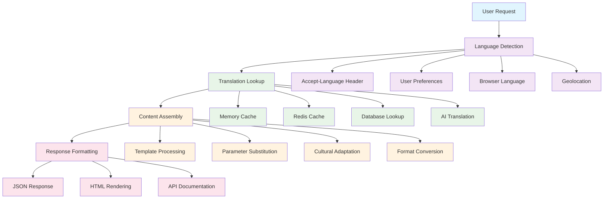

# Chapter 7: Multi-language Support

Excellent! You now have comprehensive historical analytics. Let's tackle one of Singapore's most important requirements - multi-language support. Think of this as building a "universal translator" for MRT information, ensuring that everyone in Singapore's diverse population can access critical transportation updates in their preferred language.

Singapore is uniquely multilingual with four official languages: English, Chinese (Mandarin), Malay, and Tamil. MRT information must be accessible to all residents, tourists, and workers regardless of their language background. This isn't just about translation - it's about cultural relevance and accessibility.

## Language Architecture Overview

The multi-language system is built into every layer of mrtdown:

### 1. Content Translation Strategy
Systematic approach to managing translations:

```typescript
// src/i18n/translationManager.ts
interface TranslationEntry {
  key: string;           // Unique identifier (e.g., "station.dhoby_ghaut")
  en: string;           // English
  'zh-Hans': string;    // Chinese (Simplified)
  ms: string;           // Malay
  ta: string;           // Tamil
}

class TranslationManager {
  private translations: Map<string, TranslationEntry> = new Map();

  // Load translations from JSON files
  async loadTranslations() {
    const languages = ['en', 'zh-Hans', 'ms', 'ta'];

    for (const lang of languages) {
      const translationFile = await import(`../lang/${lang}.json`);
      this.mergeTranslations(lang, translationFile.default);
    }
  }

  // Get translation with fallback
  translate(key: string, language: string): string {
    const entry = this.translations.get(key);

    if (!entry) {
      console.warn(`Translation missing for key: ${key}`);
      return key; // Fallback to key
    }

    // Try requested language, then English, then key
    return entry[language as keyof TranslationEntry] ||
           entry.en ||
           key;
  }

  // Get all available languages for a key
  getAllTranslations(key: string): TranslationEntry | null {
    return this.translations.get(key) || null;
  }
}
```

### 2. Translation File Structure
Organized JSON files for each language:

```json
// lang/en.json - English (base language)
{
  "station": {
    "dhoby_ghaut": "Dhoby Ghaut",
    "orchard": "Orchard",
    "city_hall": "City Hall"
  },
  "line": {
    "nsl": "North-South Line",
    "ewl": "East-West Line",
    "ccl": "Circle Line"
  },
  "issue": {
    "signal_fault": "Signal system fault",
    "maintenance": "Scheduled maintenance",
    "delay": "Service delay"
  }
}
```

```json
// lang/zh-Hans.json - Chinese (Simplified)
{
  "station": {
    "dhoby_ghaut": "多美歌",
    "orchard": "乌节",
    "city_hall": "政府大厦"
  },
  "line": {
    "nsl": "南北地铁线",
    "ewl": "东西地铁线",
    "ccl": "地铁环线"
  },
  "issue": {
    "signal_fault": "信号系统故障",
    "maintenance": "定期维护",
    "delay": "服务延误"
  }
}
```

```json
// lang/ms.json - Malay
{
  "station": {
    "dhoby_ghaut": "Dhoby Ghaut",
    "orchard": "Orchard",
    "city_hall": "Dewan Bandaraya"
  },
  "line": {
    "nsl": "Laluan MRT Utara Selatan",
    "ewl": "Laluan MRT Timur Barat",
    "ccl": "Laluan MRT Bulatan"
  },
  "issue": {
    "signal_fault": "Kerosakan sistem isyarat",
    "maintenance": "Penyelenggaraan berjadual",
    "delay": "Kelewatan perkhidmatan"
  }
}
```

```json
// lang/ta.json - Tamil
{
  "station": {
    "dhoby_ghaut": "டோபி காட்",
    "orchard": "ஆர்ச்சர்ட்",
    "city_hall": "சிட்டி ஹால்"
  },
  "line": {
    "nsl": "வடக்கு தெற்கு எம்ஆர்டி வழி",
    "ewl": "கிழக்கு மேற்கு எம்ஆர்டி வழி",
    "ccl": "இணைப்பு எம்ஆர்டி வழி"
  },
  "issue": {
    "signal_fault": "சமிக்ஞை அமைப்பு குறைபாடு",
    "maintenance": "திட்டமிடப்பட்ட பராமரிப்பு",
    "delay": "சேவை தாமதம்"
  }
}
```

## Translation Integration Points

Multi-language support is integrated throughout the system:

### 1. API Language Negotiation
HTTP content negotiation for language selection:

```typescript
// src/api/middleware/language.ts
export const languageMiddleware = async (c, next) => {
  // 1. Check Accept-Language header
  const acceptLanguage = c.req.header('Accept-Language') || 'en';

  // 2. Parse language preferences with quality values
  const languages = parseAcceptLanguage(acceptLanguage);

  // 3. Find best matching supported language
  const supportedLanguages = ['en', 'zh-Hans', 'ms', 'ta'];
  const bestLanguage = findBestLanguageMatch(languages, supportedLanguages);

  // 4. Set language in context
  c.set('language', bestLanguage);

  // 5. Set Content-Language header in response
  c.header('Content-Language', bestLanguage);

  await next();
};

// Parse Accept-Language header (e.g., "zh-Hans;q=0.9,en;q=0.8")
function parseAcceptLanguage(header: string) {
  return header.split(',')
    .map(lang => {
      const [code, quality = '1'] = lang.trim().split(';q=');
      return {
        code: code.split('-')[0], // Get primary language code
        quality: parseFloat(quality)
      };
    })
    .sort((a, b) => b.quality - a.quality);
}
```

### 2. Database Translation Storage
Translations stored alongside primary content:

```sql
-- Multi-language station table
CREATE TABLE stations (
  id TEXT PRIMARY KEY,
  name_en TEXT NOT NULL,
  name_zh_hans TEXT,
  name_ms TEXT,
  name_ta TEXT,

  -- Other fields...
  coordinates JSONB,
  lines JSONB,

  -- Full-text search indexes for each language
  search_vector_en TSVECTOR,
  search_vector_zh_hans TSVECTOR,
  search_vector_ms TSVECTOR,
  search_vector_ta TSVECTOR
);

-- Multi-language issue table
CREATE TABLE issues (
  id TEXT PRIMARY KEY,
  title_en TEXT NOT NULL,
  title_zh_hans TEXT,
  title_ms TEXT,
  title_ta TEXT,

  description_en TEXT,
  description_zh_hans TEXT,
  description_ms TEXT,
  description_ta TEXT,

  -- Other fields...
  type TEXT,
  severity TEXT,
  time_interval TSTZRANGE
);
```

### 3. React Component Translation
Frontend components with built-in translation:

```typescript
// src/hooks/useTranslation.ts
const useTranslation = () => {
  const { language } = useContext(LanguageContext);
  const { data: translations } = useQuery({
    queryKey: ['translations', language],
    queryFn: () => fetch(`/api/translations?lang=${language}`)
  });

  const t = (key: string, params?: Record<string, any>) => {
    let text = translations?.[key] || key;

    // Replace parameters (e.g., "Hello {name}" -> "Hello John")
    if (params) {
      Object.entries(params).forEach(([param, value]) => {
        text = text.replace(`{${param}}`, String(value));
      });
    }

    return text;
  };

  return { t, language };
};

// Usage in components
const StationCard = ({ station }) => {
  const { t } = useTranslation();

  return (
    <div>
      <h3>{t(`station.${station.id}`)}</h3>
      <p>{t('station.facilities')}: {station.facilities.join(', ')}</p>
    </div>
  );
};
```

## Advanced Translation Features

### 1. Dynamic Content Translation
Real-time translation for user-generated content:

```typescript
// src/services/translationService.ts
class TranslationService {
  private aiTranslator: AITranslator;

  async translateIssue(issue: Issue, targetLanguage: string) {
    // 1. Check if human translation exists
    if (issue.translations?.[targetLanguage]) {
      return issue.translations[targetLanguage];
    }

    // 2. Use AI for dynamic translation
    const translatedTitle = await this.aiTranslator.translate(
      issue.title,
      'en',
      targetLanguage
    );

    const translatedDescription = await this.aiTranslator.translate(
      issue.description,
      'en',
      targetLanguage
    );

    // 3. Store translation for future use
    await this.cacheTranslation(issue.id, targetLanguage, {
      title: translatedTitle,
      description: translatedDescription
    });

    return {
      title: translatedTitle,
      description: translatedDescription
    };
  }

  async translateStatusUpdate(update: StatusUpdate, targetLanguage: string) {
    // Translate real-time status updates
    const translatedMessage = await this.aiTranslator.translate(
      update.message,
      'en',
      targetLanguage
    );

    return {
      ...update,
      message: translatedMessage,
      language: targetLanguage
    };
  }
}
```

### 2. Cultural Context Adaptation
Adapting content for cultural relevance:

```typescript
// src/i18n/culturalAdapter.ts
class CulturalAdapter {
  adaptIssueForCulture(issue: Issue, language: string) {
    const adaptations = {
      'zh-Hans': {
        // Chinese cultural context
        severity: {
          'high': '严重',
          'medium': '中等',
          'low': '轻微'
        },
        timeFormat: '24-hour with Chinese numerals'
      },
      'ms': {
        // Malay cultural context
        greetings: 'Assalamualaikum for morning disruptions',
        politeness: 'More formal language for official communications'
      },
      'ta': {
        // Tamil cultural context
        numerals: 'Use Tamil numerals for times',
        respect: 'Use appropriate honorifics for officials'
      }
    };

    return this.applyCulturalAdaptations(issue, adaptations[language]);
  }

  adaptTimeFormat(time: Date, language: string) {
    switch (language) {
      case 'zh-Hans':
        return format(time, 'yyyy年MM月dd日 HH:mm');
      case 'ms':
        return format(time, 'dd/MM/yyyy HH:mm');
      case 'ta':
        return format(time, 'dd-MM-yyyy HH:mm');
      default:
        return format(time, 'MMM dd, yyyy HH:mm');
    }
  }
}
```

## User Interface Language Switching

Seamless language switching in the user interface:

### 1. Language Selector Component
```typescript
// src/components/LanguageSelector.tsx
const LanguageSelector = () => {
  const { language, setLanguage } = useContext(LanguageContext);
  const { t } = useTranslation();

  const languages = [
    { code: 'en', name: 'English', flag: '🇬🇧' },
    { code: 'zh-Hans', name: '中文', flag: '🇨🇳' },
    { code: 'ms', name: 'Bahasa Melayu', flag: '🇲🇾' },
    { code: 'ta', name: 'தமிழ்', flag: '🇮🇳' }
  ];

  return (
    <div className="relative">
      <button
        onClick={() => setIsOpen(!isOpen)}
        className="flex items-center gap-2 px-3 py-2 border rounded-lg hover:bg-gray-50"
      >
        <span>{languages.find(l => l.code === language)?.flag}</span>
        <span>{languages.find(l => l.code === language)?.name}</span>
        <ChevronDown className="w-4 h-4" />
      </button>

      {isOpen && (
        <div className="absolute top-full mt-1 bg-white border rounded-lg shadow-lg z-50">
          {languages.map(lang => (
            <button
              key={lang.code}
              onClick={() => {
                setLanguage(lang.code);
                setIsOpen(false);
              }}
              className={`w-full px-4 py-2 text-left hover:bg-gray-50 flex items-center gap-2 ${
                language === lang.code ? 'bg-blue-50 text-blue-600' : ''
              }`}
            >
              <span>{lang.flag}</span>
              <span>{lang.name}</span>
            </button>
          ))}
        </div>
      )}
    </div>
  );
};
```

### 2. Persistent Language Preferences
```typescript
// src/hooks/useLanguagePreference.ts
const useLanguagePreference = () => {
  const [language, setLanguageState] = useState(() => {
    // 1. Check localStorage first
    const stored = localStorage.getItem('mrtdown-language');
    if (stored) return stored;

    // 2. Check browser language
    const browserLang = navigator.language.split('-')[0];
    if (['en', 'zh', 'ms', 'ta'].includes(browserLang)) {
      return browserLang === 'zh' ? 'zh-Hans' : browserLang;
    }

    // 3. Default to English
    return 'en';
  });

  const setLanguage = (newLanguage: string) => {
    setLanguageState(newLanguage);
    localStorage.setItem('mrtdown-language', newLanguage);

    // Update HTML lang attribute
    document.documentElement.lang = newLanguage;

    // Track language preference
    trackEvent('language_changed', { from: language, to: newLanguage });
  };

  return { language, setLanguage };
};
```

## Content Management System

Tools for managing translations:

### 1. Translation Dashboard
```typescript
// src/components/admin/TranslationDashboard.tsx
const TranslationDashboard = () => {
  const { data: translationStats } = useQuery({
    queryKey: ['translation-stats'],
    queryFn: () => fetch('/api/admin/translations/stats')
  });

  return (
    <div className="space-y-6">
      {/* Translation coverage statistics */}
      <div className="grid grid-cols-1 md:grid-cols-4 gap-4">
        <Card>
          <div className="text-center">
            <div className="text-2xl font-bold text-green-600">
              {translationStats?.coverage?.en}%
            </div>
            <div className="text-sm text-gray-600">English</div>
          </div>
        </Card>
        <Card>
          <div className="text-center">
            <div className="text-2xl font-bold text-blue-600">
              {translationStats?.coverage?.zh}%
            </div>
            <div className="text-sm text-gray-600">Chinese</div>
          </div>
        </Card>
        <Card>
          <div className="text-center">
            <div className="text-2xl font-bold text-red-600">
              {translationStats?.coverage?.ms}%
            </div>
            <div className="text-sm text-gray-600">Malay</div>
          </div>
        </Card>
        <Card>
          <div className="text-center">
            <div className="text-2xl font-bold text-purple-600">
              {translationStats?.coverage?.ta}%
            </div>
            <div className="text-sm text-gray-600">Tamil</div>
          </div>
        </Card>
      </div>

      {/* Missing translations */}
      <Card className="p-6">
        <h3 className="text-lg font-semibold mb-4">Missing Translations</h3>
        <div className="space-y-3">
          {translationStats?.missing?.map(item => (
            <div key={item.key} className="flex items-center justify-between p-3 bg-red-50 rounded">
              <div>
                <div className="font-medium">{item.key}</div>
                <div className="text-sm text-gray-600">{item.english}</div>
              </div>
              <div className="flex gap-2">
                {item.missingLanguages.map(lang => (
                  <Badge key={lang} variant="destructive">{lang}</Badge>
                ))}
              </div>
            </div>
          ))}
        </div>
      </Card>

      {/* Translation workflow */}
      <Card className="p-6">
        <h3 className="text-lg font-semibold mb-4">Translation Workflow</h3>
        <TranslationWorkflow />
      </Card>
    </div>
  );
};
```

### 2. Quality Assurance Tools
```typescript
// src/utils/translationQA.ts
class TranslationQA {
  // Check translation consistency
  async checkConsistency(translations: TranslationEntry[]) {
    const issues = [];

    for (const translation of translations) {
      // Check for placeholder consistency
      if (this.hasInconsistentPlaceholders(translation)) {
        issues.push({
          type: 'inconsistent_placeholders',
          key: translation.key,
          severity: 'high'
        });
      }

      // Check for terminology consistency
      if (this.hasInconsistentTerminology(translation)) {
        issues.push({
          type: 'inconsistent_terminology',
          key: translation.key,
          severity: 'medium'
        });
      }

      // Check for cultural appropriateness
      if (await this.isCulturallyInappropriate(translation)) {
        issues.push({
          type: 'cultural_issues',
          key: translation.key,
          severity: 'critical'
        });
      }
    }

    return issues;
  }

  // Validate translation accuracy
  async validateAccuracy(original: string, translation: string, language: string) {
    // Use AI to check translation quality
    const quality = await this.aiValidator.validateTranslation(
      original,
      translation,
      language
    );

    return {
      score: quality.score,
      issues: quality.issues,
      suggestions: quality.suggestions
    };
  }
}
```

## Performance Optimization

### 1. Translation Caching
```typescript
// src/cache/translationCache.ts
class TranslationCache {
  private cache = new Map();

  async getTranslation(key: string, language: string) {
    const cacheKey = `${key}:${language}`;

    // Check memory cache first
    if (this.cache.has(cacheKey)) {
      return this.cache.get(cacheKey);
    }

    // Check Redis cache
    const cached = await this.redis.get(cacheKey);
    if (cached) {
      this.cache.set(cacheKey, JSON.parse(cached));
      return JSON.parse(cached);
    }

    // Fetch from database
    const translation = await this.fetchFromDatabase(key, language);

    // Cache for future use
    this.cache.set(cacheKey, translation);
    await this.redis.setex(cacheKey, 3600, JSON.stringify(translation)); // 1 hour

    return translation;
  }
}
```

### 2. Lazy Loading Translations
```typescript
// src/components/LazyTranslatedText.tsx
const LazyTranslatedText = ({ translationKey, params }) => {
  const { language } = useContext(LanguageContext);
  const [translation, setTranslation] = useState(null);
  const [isLoading, setIsLoading] = useState(false);

  useEffect(() => {
    if (!translation || translation.language !== language) {
      setIsLoading(true);
      fetch(`/api/translations/${translationKey}?lang=${language}`)
        .then(res => res.json())
        .then(data => {
          setTranslation({ text: data.translation, language });
          setIsLoading(false);
        });
    }
  }, [translationKey, language]);

  if (isLoading) {
    return <div className="animate-pulse bg-gray-200 h-4 rounded w-24"></div>;
  }

  return <span>{translation?.text || translationKey}</span>;
};
```

## Accessibility Features

### 1. Screen Reader Support
```typescript
// src/components/TranslatedScreenReader.tsx
const TranslatedScreenReader = ({ children, translationKey }) => {
  const { t } = useTranslation();

  return (
    <>
      {children}
      <span className="sr-only" aria-label={t(translationKey)}>
        {t(translationKey)}
      </span>
    </>
  );
};
```

### 2. Font and Text Direction Support
```typescript
// src/styles/languageStyles.ts
const languageStyles = {
  'zh-Hans': {
    fontFamily: '"Noto Sans SC", "Microsoft YaHei", sans-serif',
    fontSize: '14px',
    lineHeight: 1.4
  },
  'ms': {
    fontFamily: '"Noto Sans Malay", Arial, sans-serif',
    fontSize: '14px',
    lineHeight: 1.4
  },
  'ta': {
    fontFamily: '"Noto Sans Tamil", Arial, sans-serif',
    fontSize: '14px',
    lineHeight: 1.4,
    direction: 'ltr' // Tamil uses left-to-right
  },
  'en': {
    fontFamily: '"Inter", Arial, sans-serif',
    fontSize: '14px',
    lineHeight: 1.4
  }
};

// Apply language-specific styles
const LanguageStyledText = ({ language, children }) => {
  const styles = languageStyles[language] || languageStyles.en;

  return (
    <span style={styles}>
      {children}
    </span>
  );
};
```

## How it Works Under the Hood

The multi-language system integrates across all layers:



## Key Takeaways

- **Cultural Relevance**: Content adapted for each language's cultural context
- **Performance Optimized**: Intelligent caching and lazy loading
- **Quality Assurance**: Automated checks for translation accuracy
- **Accessibility First**: Screen reader support and proper font rendering
- **User Experience**: Seamless language switching and persistent preferences
- **Scalable Architecture**: Easy addition of new languages and content

---

## What's Next?

With comprehensive multi-language support in place, let's wrap up by exploring deployment and integration. In [Chapter 8](./08_deployment.md), we'll learn how to deploy mrtdown and integrate it with existing MRT systems!

> 💡 **Pro tip**: Think of multi-language support as building "bridges" between different communities. Just as bridges connect physical locations, language support connects people to the information they need, regardless of their linguistic background.
