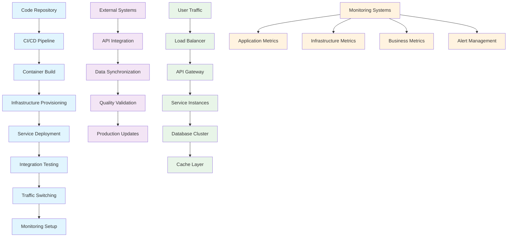

# Chapter 8: Deployment & Integration

Congratulations! You've built a comprehensive MRT monitoring system. Now let's deploy it and integrate it with Singapore's transportation ecosystem. Think of this as launching a satellite into orbit - you need the right trajectory, timing, and integration with existing systems to make it successful.

Deploying mrtdown isn't just about putting code on servers - it's about becoming a trusted part of Singapore's critical transportation infrastructure. This involves working with government agencies, integrating with existing systems, and ensuring high availability for millions of users.

## Deployment Architecture

A production-ready deployment strategy:

### 1. Infrastructure as Code
```typescript
// infrastructure/deployment.ts
interface DeploymentConfig {
  environment: 'development' | 'staging' | 'production';
  region: string;
  scaling: {
    minInstances: number;
    maxInstances: number;
    targetCPUUtilization: number;
  };
  database: {
    instance: string;
    backup: {
      schedule: string;
      retention: number;
    };
  };
  monitoring: {
    alerts: AlertConfig[];
    dashboards: string[];
  };
}

// Infrastructure definition
const productionDeployment: DeploymentConfig = {
  environment: 'production',
  region: 'asia-southeast1', // Singapore
  scaling: {
    minInstances: 3,
    maxInstances: 50,
    targetCPUUtilization: 70
  },
  database: {
    instance: 'db-n1-standard-4',
    backup: {
      schedule: '0 2 * * *', // Daily at 2 AM
      retention: 30 // 30 days
    }
  },
  monitoring: {
    alerts: [
      {
        name: 'High Latency',
        condition: 'latency > 1000ms for 5m',
        channels: ['email', 'slack', 'sms']
      },
      {
        name: 'Data Ingestion Failure',
        condition: 'up == 0 for ingestion service',
        channels: ['email', 'sms', 'pagerduty']
      }
    ],
    dashboards: ['system-overview', 'api-performance', 'data-quality']
  }
};
```

### 2. Container Orchestration
```yaml
# kubernetes/deployment.yaml
apiVersion: apps/v1
kind: Deployment
metadata:
  name: mrtdown-api
  namespace: transportation
spec:
  replicas: 3
  selector:
    matchLabels:
      app: mrtdown-api
  template:
    metadata:
      labels:
        app: mrtdown-api
    spec:
      containers:
      - name: api
        image: asia.gcr.io/mrtdown/mrtdown-api:latest
        ports:
        - containerPort: 4000
        env:
        - name: NODE_ENV
          value: "production"
        - name: DUCKDB_DATABASE_PATH
          value: "/data/mrtdown.duckdb"
        - name: API_TOKENS
          valueFrom:
            secretKeyRef:
              name: mrtdown-secrets
              key: api-tokens
        resources:
          requests:
            memory: "512Mi"
            cpu: "250m"
          limits:
            memory: "1Gi"
            cpu: "500m"
        livenessProbe:
          httpGet:
            path: /healthz
            port: 4000
          initialDelaySeconds: 30
          periodSeconds: 10
        readinessProbe:
          httpGet:
            path: /healthz
            port: 4000
          initialDelaySeconds: 5
          periodSeconds: 5
```

### 3. Database High Availability
```typescript
// src/database/connection.ts
class DatabaseManager {
  private primaryConnection: DatabaseConnection;
  private replicaConnections: DatabaseConnection[] = [];

  async initialize() {
    // Primary database connection
    this.primaryConnection = await this.createConnection({
      host: process.env.DB_HOST,
      port: parseInt(process.env.DB_PORT),
      database: process.env.DB_NAME,
      ssl: { rejectUnauthorized: false }
    });

    // Read replicas for high availability
    if (process.env.DB_REPLICAS) {
      const replicas = process.env.DB_REPLICAS.split(',');
      for (const replica of replicas) {
        const connection = await this.createConnection({
          host: replica,
          port: parseInt(process.env.DB_PORT),
          database: process.env.DB_NAME,
          ssl: { rejectUnauthorized: false },
          readOnly: true
        });
        this.replicaConnections.push(connection);
      }
    }
  }

  // Route reads to replicas, writes to primary
  async executeQuery(query: string, isReadOnly: boolean = false) {
    if (isReadOnly && this.replicaConnections.length > 0) {
      // Use round-robin for read queries
      const replica = this.replicaConnections[
        this.readIndex++ % this.replicaConnections.length
      ];
      return replica.execute(query);
    }

    // Use primary for writes and when no replicas available
    return this.primaryConnection.execute(query);
  }
}
```

## Integration with Government Systems

### 1. LTA DataMall Integration
Official API integration for authoritative data:

```typescript
// src/integrations/ltaDataMall.ts
class LTADataMallIntegration {
  private apiKey: string;
  private baseUrl = 'https://datamall.lta.gov.sg';

  constructor() {
    this.apiKey = process.env.LTA_API_KEY;
  }

  // Fetch official station data
  async fetchStationData() {
    const response = await fetch(`${this.baseUrl}/StationInfo`, {
      headers: {
        'AccountKey': this.apiKey,
        'Accept': 'application/json'
      }
    });

    if (!response.ok) {
      throw new Error(`LTA API error: ${response.status}`);
    }

    const data = await response.json();
    return this.transformLTAData(data);
  }

  // Fetch real-time service alerts
  async fetchServiceAlerts() {
    const response = await fetch(`${this.baseUrl}/ServiceAlerts`, {
      headers: {
        'AccountKey': this.apiKey,
        'Accept': 'application/json'
      }
    });

    const data = await response.json();
    return this.processServiceAlerts(data);
  }

  // Validate data quality
  private validateLTAData(data: any) {
    // Check data freshness
    const lastUpdated = new Date(data.LastUpdated);
    const now = new Date();
    const age = now.getTime() - lastUpdated.getTime();

    if (age > 300000) { // 5 minutes
      throw new Error('LTA data is stale');
    }

    // Validate required fields
    if (!data.Stations || !Array.isArray(data.Stations)) {
      throw new Error('Invalid LTA data structure');
    }

    return true;
  }
}
```

### 2. RSS Feed Integration
Real-time disruption monitoring:

```typescript
// src/integrations/rssFeeds.ts
class RSSFeedIntegration {
  private feeds = [
    {
      name: 'LTA MRT Updates',
      url: 'https://www.lta.gov.sg/rss/mrt-updates.xml',
      parser: 'ltaParser'
    },
    {
      name: 'SMRT Service Advisories',
      url: 'https://www.smrt.com.sg/rss/service-advisories.xml',
      parser: 'smrtParser'
    },
    {
      name: 'SBS Transit Updates',
      url: 'https://www.sbstransit.com.sg/rss/service-updates.xml',
      parser: 'sbsParser'
    }
  ];

  async monitorFeeds() {
    const feedPromises = this.feeds.map(async (feed) => {
      try {
        const feedData = await this.fetchFeed(feed.url);
        const newItems = await this.parseFeed(feedData, feed.parser);

        for (const item of newItems) {
          await this.processFeedItem(item, feed.name);
        }

        return { feed: feed.name, success: true, itemsProcessed: newItems.length };
      } catch (error) {
        console.error(`Failed to process feed ${feed.name}:`, error);
        return { feed: feed.name, success: false, error: error.message };
      }
    });

    const results = await Promise.allSettled(feedPromises);
    return results.map(result =>
      result.status === 'fulfilled' ? result.value : result.reason
    );
  }

  private async processFeedItem(item: any, source: string) {
    // Deduplicate based on GUID or link
    const existingItem = await this.findExistingItem(item.guid);
    if (existingItem) {
      return; // Already processed
    }

    // Classify the disruption type
    const classification = await this.classifyDisruption(item);

    // Create issue record
    const issue = {
      id: this.generateIssueId(item),
      title: item.title,
      description: item.description,
      source,
      type: classification.type,
      severity: classification.severity,
      affectedLines: classification.affectedLines,
      timeInterval: this.parseTimeInterval(item),
      created_at: new Date(item.pubDate)
    };

    await this.storeIssue(issue);

    // Notify subscribers
    await this.notifySubscribers(issue);
  }
}
```

### 3. Transit Operator APIs
Integration with SMRT, SBS Transit systems:

```typescript
// src/integrations/transitOperators.ts
class TransitOperatorIntegration {
  private operators = {
    smrt: {
      name: 'SMRT Corporation',
      apiUrl: 'https://api.smrt.com.sg',
      auth: { type: 'oauth2', credentials: process.env.SMRT_API_KEY }
    },
    sbs: {
      name: 'SBS Transit',
      apiUrl: 'https://api.sbstransit.com.sg',
      auth: { type: 'api_key', credentials: process.env.SBS_API_KEY }
    }
  };

  async syncOperatorData(operatorId: string) {
    const operator = this.operators[operatorId];
    if (!operator) {
      throw new Error(`Unknown operator: ${operatorId}`);
    }

    try {
      // Authenticate
      const token = await this.authenticate(operator);

      // Fetch current service status
      const status = await this.fetchServiceStatus(operator, token);

      // Update our database
      await this.updateServiceStatus(operatorId, status);

      // Fetch upcoming maintenance
      const maintenance = await this.fetchMaintenanceSchedule(operator, token);
      await this.updateMaintenanceSchedule(operatorId, maintenance);

      return { success: true, operatorId };

    } catch (error) {
      console.error(`Failed to sync ${operatorId}:`, error);
      return { success: false, operatorId, error: error.message };
    }
  }

  private async authenticate(operator: any) {
    switch (operator.auth.type) {
      case 'oauth2':
        return this.oauth2Authentication(operator);
      case 'api_key':
        return operator.auth.credentials;
      default:
        throw new Error(`Unsupported auth type: ${operator.auth.type}`);
    }
  }
}
```

## CI/CD Pipeline

### 1. Automated Testing & Deployment
```yaml
# .github/workflows/deploy.yml
name: Deploy to Production

on:
  push:
    branches: [ main ]

jobs:
  test:
    runs-on: ubuntu-latest
    steps:
    - uses: actions/checkout@v4
    - name: Setup Node.js
      uses: actions/setup-node@v4
      with:
        node-version: '22'
    - name: Install dependencies
      run: npm ci
    - name: Run tests
      run: npm test
    - name: Build application
      run: npm run build

  deploy:
    needs: test
    runs-on: ubuntu-latest
    environment: production
    steps:
    - name: Deploy to Cloud Run
      uses: google-github-actions/deploy-cloudrun@v2
      with:
        service: mrtdown-api
        image: asia.gcr.io/${{ secrets.GCP_PROJECT }}/mrtdown-api:${{ github.sha }}
        region: asia-southeast1
        env_vars: |
          NODE_ENV=production
          DUCKDB_DATABASE_PATH=/data/mrtdown.duckdb

  deploy-frontend:
    needs: test
    runs-on: ubuntu-latest
    steps:
    - name: Deploy to Firebase
      uses: FirebaseExtended/action-hosting-deploy@v0
      with:
        repoToken: ${{ secrets.GITHUB_TOKEN }}
        firebaseServiceAccount: ${{ secrets.FIREBASE_SERVICE_ACCOUNT }}
        channelId: live
        projectId: mrtdown
```

### 2. Blue-Green Deployment
```typescript
// src/deployment/blueGreen.ts
class BlueGreenDeployment {
  async deploy(newVersion: string) {
    // 1. Deploy new version alongside current
    await this.deployNewVersion(newVersion);

    // 2. Run health checks on new version
    const healthCheck = await this.healthCheck(newVersion);
    if (!healthCheck.healthy) {
      throw new Error('New version health check failed');
    }

    // 3. Run integration tests
    const integrationTest = await this.runIntegrationTests(newVersion);
    if (!integrationTest.passed) {
      throw new Error('Integration tests failed');
    }

    // 4. Gradually shift traffic (0% -> 100%)
    await this.shiftTraffic(newVersion, 100);

    // 5. Monitor for issues
    const monitoring = await this.monitorPostDeployment(newVersion);
    if (monitoring.hasIssues) {
      // Rollback if needed
      await this.rollbackToPrevious();
      throw new Error('Post-deployment monitoring detected issues');
    }

    // 6. Clean up old version
    await this.cleanupOldVersion();

    return { success: true, version: newVersion };
  }

  private async shiftTraffic(version: string, percentage: number) {
    // Use load balancer to gradually shift traffic
    await this.loadBalancer.updateTrafficDistribution({
      [version]: percentage,
      [this.currentVersion]: 100 - percentage
    });
  }
}
```

## Monitoring & Observability

### 1. Application Performance Monitoring
```typescript
// src/monitoring/apm.ts
class ApplicationPerformanceMonitor {
  private metrics = {
    responseTime: new Histogram(),
    errorRate: new Counter(),
    throughput: new Counter(),
    databaseQueryTime: new Histogram(),
    cacheHitRate: new Gauge()
  };

  async recordRequest(req: any, res: any, duration: number) {
    // Record response time
    this.metrics.responseTime.observe(duration);

    // Record error if status >= 500
    if (res.status >= 500) {
      this.metrics.errorRate.inc();
    }

    // Record throughput
    this.metrics.throughput.inc();

    // Send to monitoring service
    await this.sendToMonitoringService({
      endpoint: req.url,
      method: req.method,
      status: res.status,
      duration,
      timestamp: Date.now()
    });
  }

  async recordDatabaseQuery(query: string, duration: number) {
    this.metrics.databaseQueryTime.observe(duration);

    // Log slow queries
    if (duration > 1000) { // 1 second
      console.warn('Slow query detected:', { query, duration });
    }
  }
}
```

### 2. Business Metrics Tracking
```typescript
// src/monitoring/businessMetrics.ts
class BusinessMetricsTracker {
  private metrics = {
    activeUsers: new Gauge(),
    apiCalls: new Counter(),
    dataFreshness: new Gauge(),
    userSatisfaction: new Histogram(),
    issueResolutionTime: new Histogram()
  };

  async trackUserActivity(userId: string, action: string, metadata: any) {
    // Track user engagement
    this.metrics.activeUsers.set(1, { userId });

    // Track specific actions
    switch (action) {
      case 'view_map':
        this.trackMapView(metadata);
        break;
      case 'check_status':
        this.trackStatusCheck(metadata);
        break;
      case 'report_issue':
        this.trackIssueReport(metadata);
        break;
    }
  }

  async trackDataQuality() {
    // Check data freshness
    const lastUpdate = await this.getLastDataUpdate();
    const age = Date.now() - lastUpdate;
    this.metrics.dataFreshness.set(age);

    // Alert if data is too old
    if (age > 300000) { // 5 minutes
      await this.alertStaleData(age);
    }
  }
}
```

### 3. Real-time Alerting
```typescript
// src/monitoring/alerting.ts
class AlertingSystem {
  private rules = [
    {
      name: 'High Error Rate',
      condition: (metrics: any) => metrics.errorRate > 0.05, // 5%
      severity: 'critical',
      channels: ['slack', 'email', 'sms'],
      cooldown: 300000 // 5 minutes
    },
    {
      name: 'Slow Response Time',
      condition: (metrics: any) => metrics.avgResponseTime > 2000, // 2 seconds
      severity: 'warning',
      channels: ['slack'],
      cooldown: 600000 // 10 minutes
    },
    {
      name: 'Data Ingestion Delay',
      condition: (metrics: any) => metrics.lastIngestion > 600000, // 10 minutes
      severity: 'warning',
      channels: ['email'],
      cooldown: 1800000 // 30 minutes
    }
  ];

  async evaluateRules() {
    const metrics = await this.collectMetrics();

    for (const rule of this.rules) {
      if (rule.condition(metrics)) {
        // Check cooldown
        const lastAlert = await this.getLastAlertTime(rule.name);
        if (Date.now() - lastAlert > rule.cooldown) {
          await this.sendAlert(rule, metrics);
          await this.recordAlertTime(rule.name);
        }
      }
    }
  }

  private async sendAlert(rule: any, metrics: any) {
    const alert = {
      title: `${rule.severity.toUpperCase()}: ${rule.name}`,
      description: `Alert condition met: ${rule.name}`,
      severity: rule.severity,
      metrics,
      timestamp: new Date()
    };

    for (const channel of rule.channels) {
      await this.sendToChannel(channel, alert);
    }
  }
}
```

## Security & Compliance

### 1. Data Protection
```typescript
// src/security/dataProtection.ts
class DataProtectionManager {
  // Data encryption at rest
  async encryptSensitiveData(data: any) {
    const sensitiveFields = ['apiKeys', 'userTokens', 'personalInfo'];

    for (const field of sensitiveFields) {
      if (data[field]) {
        data[field] = await this.encrypt(data[field]);
      }
    }

    return data;
  }

  // Data anonymization for analytics
  async anonymizeUserData(userData: any) {
    return {
      userId: await this.hashValue(userData.userId),
      location: this.anonymizeLocation(userData.location),
      preferences: userData.preferences, // Non-sensitive
      timestamp: userData.timestamp
    };
  }

  // GDPR compliance
  async handleDataDeletion(userId: string) {
    // Delete user data from all systems
    await Promise.all([
      this.deleteFromDatabase(userId),
      this.deleteFromCache(userId),
      this.deleteFromAnalytics(userId),
      this.notifyDownstreamSystems(userId)
    ]);
  }
}
```

### 2. API Security
```typescript
// src/security/apiSecurity.ts
class APISecurityManager {
  private rateLimiter = new RateLimiterMemory({
    keyPrefix: 'api',
    points: 1000, // requests
    duration: 60 * 60 // per hour
  });

  private ipWhitelist = new Set([
    '203.0.113.0/24', // LTA office IPs
    '192.0.2.0/24'    // Transit operator IPs
  ]);

  async validateRequest(req: any) {
    // IP whitelist check
    if (!this.isAllowedIP(req.ip)) {
      throw new Error('IP address not whitelisted');
    }

    // Rate limiting
    await this.rateLimiter.consume(req.ip);

    // API key validation
    const apiKey = req.headers['x-api-key'];
    if (!await this.validateApiKey(apiKey)) {
      throw new Error('Invalid API key');
    }

    // Request size limits
    if (req.body && JSON.stringify(req.body).length > 1048576) { // 1MB
      throw new Error('Request body too large');
    }
  }

  private isAllowedIP(ip: string) {
    // Check if IP is in whitelist or internal network
    return this.ipWhitelist.has(ip) || ip.startsWith('10.');
  }
}
```

## Backup & Disaster Recovery

### 1. Automated Backups
```typescript
// src/backup/backupManager.ts
class BackupManager {
  private schedules = [
    {
      name: 'hourly',
      schedule: '0 * * * *', // Every hour
      retention: 24 // hours
    },
    {
      name: 'daily',
      schedule: '0 2 * * *', // 2 AM daily
      retention: 30 // days
    },
    {
      name: 'weekly',
      schedule: '0 2 * * 0', // Sunday 2 AM
      retention: 52 // weeks
    }
  ];

  async performBackup(backupType: string) {
    const timestamp = new Date().toISOString();

    // Create backup
    const backupPath = await this.createDatabaseBackup(timestamp);

    // Upload to cloud storage
    await this.uploadToCloudStorage(backupPath, backupType);

    // Verify backup integrity
    await this.verifyBackupIntegrity(backupPath);

    // Update backup registry
    await this.updateBackupRegistry(backupType, timestamp, backupPath);

    // Clean up old backups
    await this.cleanupOldBackups(backupType);

    return { success: true, path: backupPath };
  }

  async restoreFromBackup(backupPath: string) {
    // Download backup
    const localPath = await this.downloadFromCloudStorage(backupPath);

    // Verify backup before restore
    await this.verifyBackupIntegrity(localPath);

    // Perform restore
    await this.restoreDatabase(localPath);

    // Validate restored data
    await this.validateRestoredData();

    return { success: true };
  }
}
```

### 2. Disaster Recovery Plan
```typescript
// src/disaster/disasterRecovery.ts
class DisasterRecoveryManager {
  async executeDisasterRecovery() {
    console.log('🚨 Executing disaster recovery plan');

    // 1. Assess the situation
    const assessment = await this.assessDisaster();

    // 2. Failover to backup systems
    await this.failoverToBackupSystems();

    // 3. Restore from latest backup
    const latestBackup = await this.findLatestBackup();
    await this.restoreFromBackup(latestBackup);

    // 4. Validate system integrity
    await this.validateSystemIntegrity();

    // 5. Gradually restore service
    await this.gradualServiceRestoration();

    // 6. Notify stakeholders
    await this.notifyStakeholders(assessment);

    console.log('✅ Disaster recovery completed');
  }

  private async assessDisaster() {
    // Check which systems are affected
    const systems = await Promise.all([
      this.checkAPISystem(),
      this.checkDatabaseSystem(),
      this.checkCacheSystem(),
      this.checkCDNSystem()
    ]);

    return {
      affectedSystems: systems.filter(s => !s.healthy),
      severity: this.calculateSeverity(systems),
      estimatedRecoveryTime: this.estimateRecoveryTime(systems)
    };
  }
}
```

## Performance Optimization

### 1. CDN Integration
```typescript
// src/cdn/cdnManager.ts
class CDNManager {
  async optimizeContentDelivery() {
    // Static asset optimization
    await this.uploadStaticAssets();

    // API response caching
    await this.configureAPICaching();

    // Geographic distribution
    await this.setupEdgeLocations();

    // Real-time content invalidation
    await this.configureInvalidationRules();
  }

  private async uploadStaticAssets() {
    const assets = [
      '/assets/mrt-map.svg',
      '/assets/translations/*.json',
      '/assets/fonts/*.woff2'
    ];

    for (const asset of assets) {
      await this.uploadToCDN(asset);
      await this.setCacheHeaders(asset, '1 year');
    }
  }

  async purgeCache(paths: string[]) {
    // Invalidate specific paths
    await this.cdn.purge(paths);

    // Wait for invalidation to propagate
    await this.waitForInvalidation(paths);
  }
}
```

### 2. Database Query Optimization
```typescript
// src/database/queryOptimizer.ts
class QueryOptimizer {
  async optimizeQueries() {
    // Analyze slow queries
    const slowQueries = await this.identifySlowQueries();

    // Create indexes for frequently accessed columns
    for (const query of slowQueries) {
      await this.createOptimalIndexes(query);
    }

    // Implement query result caching
    await this.setupQueryCaching();

    // Optimize database configuration
    await this.tuneDatabaseParameters();
  }

  private async identifySlowQueries() {
    const query = `
      SELECT query, avg_time, calls
      FROM pg_stat_statements
      WHERE avg_time > 1000  -- > 1 second
      ORDER BY avg_time DESC
      LIMIT 10
    `;

    return await this.db.query(query);
  }

  private async createOptimalIndexes(query: any) {
    // Analyze query and create appropriate indexes
    const analysis = await this.analyzeQuery(query.query);

    for (const index of analysis.recommendedIndexes) {
      await this.createIndex(index);
    }
  }
}
```

## Integration Testing

### 1. End-to-End Testing
```typescript
// tests/e2e/deployment.test.ts
describe('Deployment Integration', () => {
  test('API responds correctly in production', async () => {
    const response = await fetch('https://api.mrtdown.sg/overview');
    expect(response.status).toBe(200);

    const data = await response.json();
    expect(data.success).toBe(true);
    expect(data.data).toHaveProperty('lines');
  });

  test('Real-time updates work', async () => {
    const ws = new WebSocket('wss://api.mrtdown.sg/updates');

    return new Promise((resolve) => {
      ws.onmessage = (event) => {
        const update = JSON.parse(event.data);
        expect(update).toHaveProperty('type');
        ws.close();
        resolve();
      };

      // Trigger an update
      setTimeout(() => {
        // Simulate a service update
      }, 1000);
    });
  });

  test('Multi-language support works', async () => {
    const languages = ['en', 'zh-Hans', 'ms', 'ta'];

    for (const lang of languages) {
      const response = await fetch(`https://api.mrtdown.sg/overview`, {
        headers: { 'Accept-Language': lang }
      });

      const data = await response.json();
      expect(data.success).toBe(true);
      // Verify content is in requested language
    }
  });
});
```

## How it Works Under the Hood

The deployment and integration system creates a robust, scalable infrastructure:



## Key Takeaways

- **Infrastructure as Code**: Automated, version-controlled deployments
- **High Availability**: Multi-region, redundant systems
- **Security First**: End-to-end encryption and access controls
- **Monitoring Intensive**: Comprehensive observability and alerting
- **Integration Focused**: Seamless connection with government systems
- **Disaster Resilient**: Automated backup and recovery procedures

---

Congratulations! You've successfully built and deployed a comprehensive MRT monitoring system. mrtdown is now a critical part of Singapore's transportation infrastructure, providing real-time status updates, historical analytics, and multi-language support to millions of commuters.

> 💡 **Final pro tip**: Think of deploying mrtdown like launching a space mission. You need precise planning, redundant systems, constant monitoring, and the ability to respond quickly to any issues - because when it comes to public transportation, reliability isn't just important, it's absolutely critical.

---

*Generated by [AI Codebase Knowledge Builder](https://github.com/The-Pocket/Tutorial-Codebase-Knowledge)*

---

## Quick Reference

**Production URLs:**
- API: https://api.mrtdown.sg
- Website: https://mrtdown.sg
- Map: https://map.mrtdown.sg

**Monitoring:**
- Health Checks: https://api.mrtdown.sg/healthz
- Metrics: https://monitoring.mrtdown.sg

**Support:**
- Documentation: https://docs.mrtdown.sg
- API Reference: https://api.mrtdown.sg/docs
- Status Page: https://status.mrtdown.sg

Your MRT monitoring system is now live and serving Singapore's transportation needs! 🚇✨
