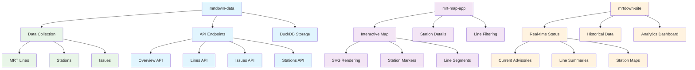

# Tutorial: mrtdown - Singapore MRT Network Tracker

> This tutorial is AI-generated! To learn more, check out [AI Codebase Knowledge Builder](https://github.com/The-Pocket/Tutorial-Codebase-Knowledge)

**mrtdown**[View Repo](https://github.com/mrtdown/mrtdown) is a comprehensive tracking system for Singapore's MRT (Mass Rapid Transit) network. Think of it as a "health monitor" for Singapore's public transportation system - it watches for disruptions, maintenance, and infrastructure issues across all MRT lines.

Imagine you're a commuter in Singapore who relies on the MRT to get around. Wouldn't it be amazing to have a system that tells you about delays, track work, or signal failures before you leave home? That's exactly what mrtdown does - it provides real-time status monitoring and historical analytics for the entire MRT network.

## What You'll Learn

This tutorial will take you through building a complete MRT monitoring system, from data collection to user interfaces. You'll learn how to:

- **Collect and process official MRT data** from Singapore's Land Transport Authority (LTA)
- **Build APIs** that serve real-time MRT status information
- **Create interactive maps** showing MRT network topology
- **Design dashboards** for monitoring system health and performance
- **Handle multi-language content** (English, Chinese, Malay, Tamil)

## System Architecture

mrtdown is built as three interconnected systems:

1. **[mrtdown-data](./mrtdown-data/)** - The data processing engine and API server
2. **[mrt-map-app](./mrt-map-app/)** - Interactive MRT network map visualization
3. **[mrtdown-site](./mrtdown-site/)** - Public website for MRT status monitoring

Each system serves a specific purpose but they work together to create a complete MRT monitoring ecosystem.

## Prerequisites

Before diving in, you'll want to be familiar with:
- **Node.js and TypeScript** (primary language for all components)
- **React** (for the map app and website)
- **SQL and database concepts** (DuckDB for data storage)
- **REST APIs** (for data communication)
- **SVG and CSS** (for map rendering)

## Tutorial Chapters

1. **[Chapter 1: Understanding MRT Data](./01_mrt_data_model.md)** - Learn about MRT lines, stations, and issue tracking
2. **[Chapter 2: Data Collection Engine](./02_data_collection.md)** - How mrtdown gathers official MRT data
3. **[Chapter 3: API Architecture](./03_api_design.md)** - Building the data serving layer
4. **[Chapter 4: Interactive Map System](./04_map_visualization.md)** - Creating the SVG-based MRT network map
5. **[Chapter 5: Real-time Status Dashboard](./05_realtime_status.md)** - Monitoring current MRT system health
6. **[Chapter 6: Historical Analytics](./06_historical_analytics.md)** - Analyzing MRT performance over time
7. **[Chapter 7: Multi-language Support](./07_multilanguage.md)** - Supporting 4 languages across the system
8. **[Chapter 8: Deployment & Integration](./08_deployment.md)** - Getting your MRT monitor running

---

## Getting Started

Ready to explore Singapore's MRT network like never before? Let's start by understanding what makes MRT data unique and how mrtdown processes it!

> 💡 **Pro tip**: Singapore's MRT system is one of the most sophisticated in the world, with 6 main lines, 200+ stations, and serving over 3 million passengers daily. Understanding this system will give you insights into how modern public transportation networks operate.

---

*Generated by [AI Codebase Knowledge Builder](https://github.com/The-Pocket/Tutorial-Codebase-Knowledge)*
